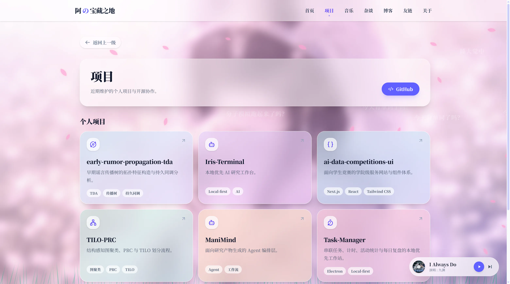
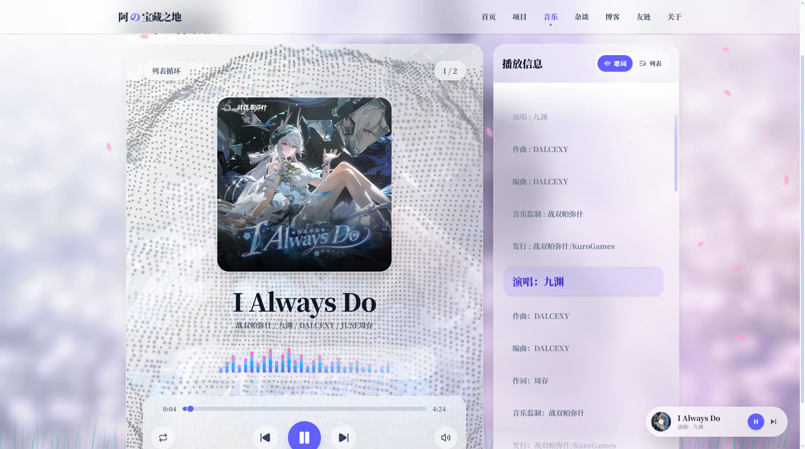
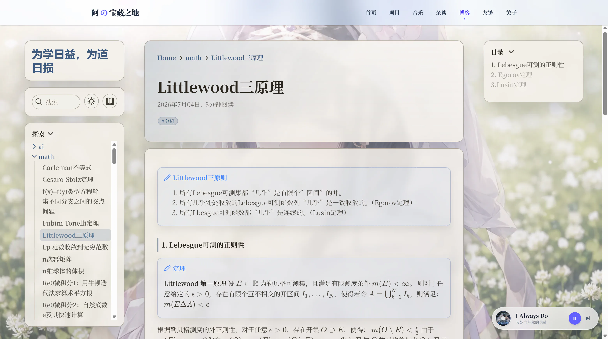
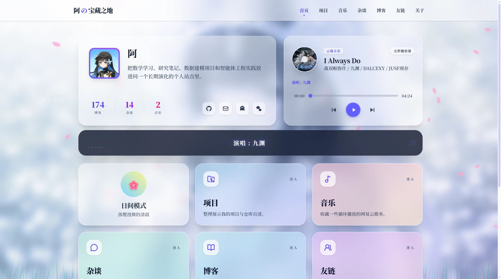

# 阿の宝藏之地

一个持续演化的个人站点：把项目作品、音乐收藏、随笔和数学知识库放在同一套体验中。

它不再只是 Obsidian 笔记的发布出口，而是由 **Next.js 主站、Quartz 静态知识库、音乐播放器与内容同步工具**共同组成的开源个人网站。

<p align="center">
  <a href="https://nothing-new.icu"></a>
  
  
  
  <a href="./LICENSE.txt"></a>
</p>

## 项目亮点

- **统一的个人主页**：集中呈现个人简介、项目、音乐、杂谈、博客、友链与关于页面。
- **沉浸式视觉体验**：玻璃拟态卡片、动态背景、主题切换、樱花与粒子等可配置效果。
- **全局音乐体验**：网易云歌单、歌词、播放队列和跨页面悬浮播放器。
- **结构化项目展示**：通过本地数据维护项目卡片、标签和仓库入口。
- **Quartz 知识库**：支持全文搜索、目录、数学公式、双向链接与 Markdown 内容发布。
- **可选 Obsidian 工作流**：可以从外部 Vault 审阅并同步公开笔记，也可以直接维护 `content/`，使用站点本身不依赖 Obsidian。

## 页面预览

| 项目                                                                       | 音乐                                                                    |
| -------------------------------------------------------------------------- | ----------------------------------------------------------------------- |
|  |  |
| **Quartz 博客与数学知识库**                                                | **首页与全局播放器**                                                    |
|      |   |

## 技术栈

| 层级       | 主要技术                                           |
| ---------- | -------------------------------------------------- |
| Web 应用   | Next.js 16、React 19、TypeScript、Tailwind CSS 4   |
| 交互与视觉 | Framer Motion、Three.js、React Three Fiber、PixiJS |
| 内容系统   | Quartz、Markdown、KaTeX、Shiki、FlexSearch         |
| 编辑与数据 | Tiptap、本地 TypeScript 数据文件                   |
| 工程化     | ESLint、Prettier、Docker、Vercel                   |

## 快速开始

### 环境要求

- Node.js `22.x`（仓库提供 `.node-version`）
- npm `>= 10.9.2`

站点主体无需环境变量即可启动；“番剧”页需要服务端环境变量 `BANGUMI_ACCESS_TOKEN`。复制 `.env.example` 为 `.env.local` 并填入 Bangumi Access Token，部署时也需在平台环境变量中配置。Token 仅供服务端读取，不要添加 `NEXT_PUBLIC_` 前缀。

```bash
git clone https://github.com/proffitteoy/math-vault.git
cd math-vault
npm ci
npm run dev
```

浏览器访问 <http://localhost:3000>。启动前会先把 `content/` 构建为 `public/blog/` 下的 Quartz 静态站点，因此首次运行会比普通 Next.js 项目稍慢。

## 常用命令

| 命令                        | 作用                                      |
| --------------------------- | ----------------------------------------- |
| `npm run dev`               | 构建 Quartz 内容并启动 Next.js 开发服务器 |
| `npm run build`             | 生成 Quartz 站点并执行生产构建            |
| `npm run start`             | 启动已完成构建的生产服务器                |
| `npm run lint`              | 执行 ESLint 检查                          |
| `npm run typecheck`         | 执行 TypeScript 类型检查                  |
| `npm test`                  | 运行测试                                  |
| `npm run quartz:build:site` | 只生成 `public/blog/` 静态知识库          |
| `npm run sync:obsidian:dry` | 预览 Obsidian 同步结果，不写入文件        |
| `npm run sync:obsidian`     | 审阅并同步获准公开的笔记                  |

## 内容与配置

- 全站标题、头像、背景、社交链接、歌单与视觉开关：`siteConfig.ts`
- 番剧收藏：由 Bangumi API 动态同步，凭据通过 `BANGUMI_ACCESS_TOKEN` 配置
- 项目、友链等结构化数据：`data/`
- Next.js 页面与接口：`app/`
- 通用 UI 与播放器组件：`components/`
- Quartz 博客与公开知识库内容：`content/`
- Quartz 配置与布局：`quartz.config.ts`、`quartz.layout.ts`
- 自动化与 Obsidian 同步：`scripts/`、`obsidian-sync.config.mjs`

`public/blog/` 是构建产物，请不要手动修改。若采用 Obsidian 写作，请先阅读[同步说明](./docs/project/obsidian-sync.md)；不使用 Obsidian 时，直接维护 `content/` 即可。

## 项目结构

```text
.
├── app/                    # Next.js App Router 页面与 API
├── components/             # 主站组件、视觉效果与音乐播放器
├── content/                # Quartz 博客和知识库源内容
├── data/                   # 项目、友链等站点数据
├── docs/project/           # 本仓库专属维护文档
├── public/                 # 公共资源与生成后的博客站点
├── quartz/                 # Quartz 引擎
├── scripts/                # 同步和维护脚本
├── siteConfig.ts           # 全站配置中心
├── quartz.config.ts        # Quartz 内容配置
└── quartz.layout.ts        # Quartz 页面布局
```

## 部署

推荐直接使用 Vercel 部署：导入仓库后将 **Root Directory 保持为仓库根目录**，构建命令使用 `npm run build`。该命令会先生成 Quartz 静态站点，再构建 Next.js 主站。

也可以使用仓库中的 `Dockerfile` 自行构建镜像。

## 参与贡献

欢迎提交 Bug、体验改进、文档修正和功能建议。

1. Fork 本仓库并从 `main` 创建分支。
2. 保持修改聚焦，补充必要的文档或测试。
3. 提交前运行 `npm run lint`、`npm run typecheck`，涉及构建流程时再运行 `npm run build`。
4. 提交 Pull Request，说明动机、变更范围和验证结果；界面变更请附截图。

参与前请遵守[社区行为准则](./CODE_OF_CONDUCT.md)。问题与建议可通过 [GitHub Issues](https://github.com/proffitteoy/math-vault/issues) 提交。

## 常见问题

### PowerShell 阻止运行 `npm.ps1`

使用 `npm.cmd` 代替 `npm`，例如：

```powershell
npm.cmd run dev
```

### 博客内容没有更新

确认修改的是 `content/` 源文件，然后重新运行 `npm run quartz:build:site`。不要直接编辑 `public/blog/`。

## 许可证与致谢

本仓库整体统一采用 [GNU General Public License v3.0](./LICENSE.txt)。第三方代码和素材仍保留各自的版权与署名要求，详情见[第三方代码与授权说明](./docs/project/third-party-notices.md)。

感谢 [Next.js](https://nextjs.org/)、[Quartz](https://quartz.jzhao.xyz/) 及所有开源依赖与内容工具的维护者。
