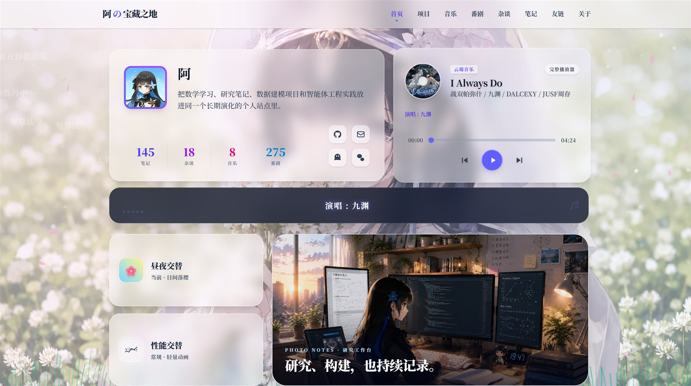
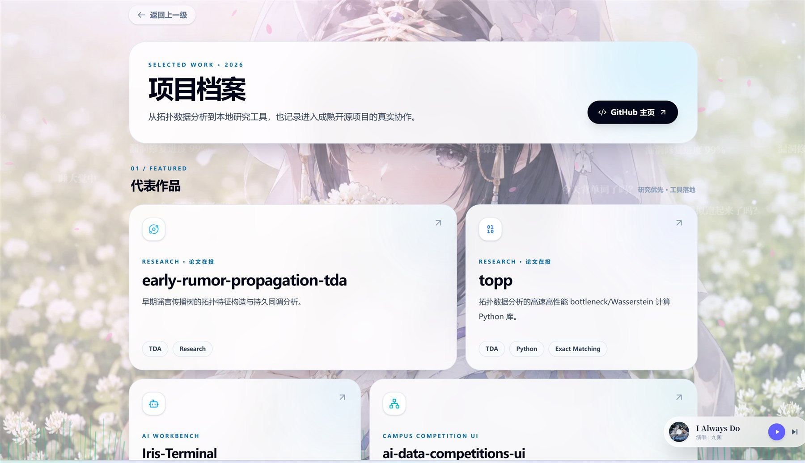
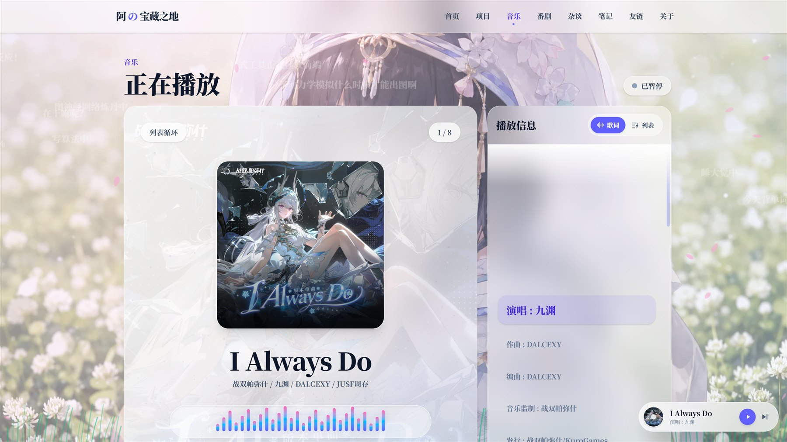
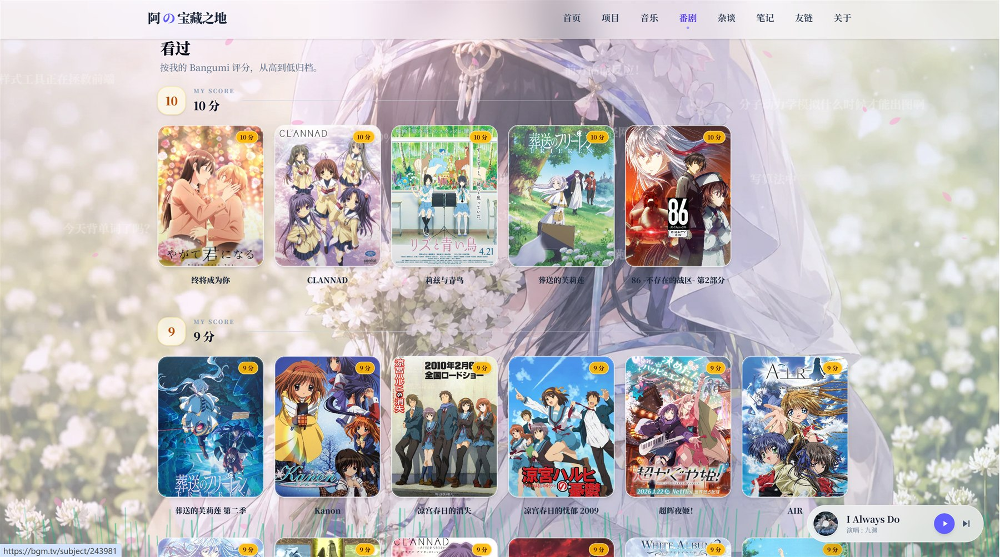
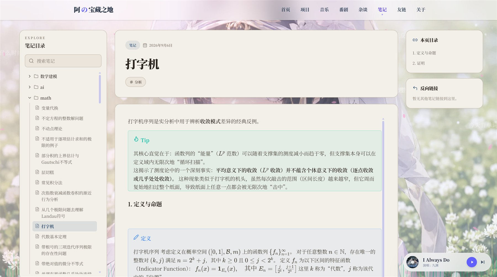
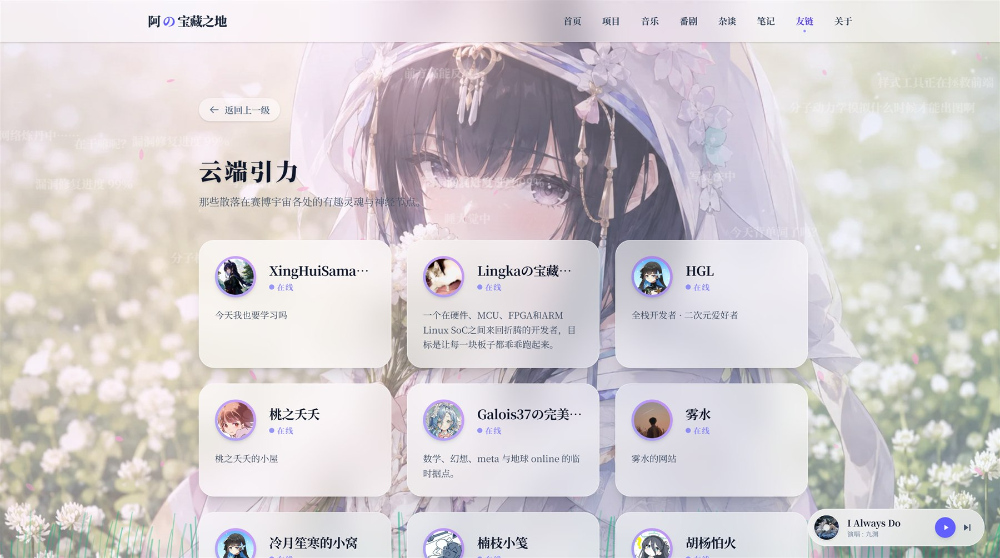

# 阿の宝藏之地

<p align="center">
  <strong>把研究、项目、笔记与兴趣收藏放进同一座持续生长的个人站点。</strong>
</p>

<p align="center">
  <a href="https://nothing-new.icu"></a>
  
  
  
  <a href="./LICENSE.txt"></a>
</p>

<p align="center">
  
</p>

## 关于这个站点

“阿の宝藏之地”不是单一用途的博客模板，而是一套围绕个人内容建立的长期归档系统：项目与开源经历有独立展柜，音乐、番剧、杂谈与数学笔记共享同一套视觉语言，播放器和场景效果则贯穿整个站点。

站点由 **Next.js 主站**与经过本地化改造的 **Quartz 内容管线**共同组成。Markdown 仍是内容源，构建时会生成可供主站读取的文章、目录、搜索索引、反向链接和静态资源；Obsidian 只是可选的写作入口，并不是运行依赖。

## 页面与能力

| 页面 | 路径                                                       | 主要内容                                               |
| ---- | ---------------------------------------------------------- | ------------------------------------------------------ |
| 首页 | [<code>/</code>](https://nothing-new.icu/)                 | 个人资料、内容统计、当前音乐、昼夜与性能模式、站点状态 |
| 项目 | [<code>/projects</code>](https://nothing-new.icu/projects) | 研究工作、AI 工具、竞赛项目与开源贡献                  |
| 音乐 | [<code>/music</code>](https://nothing-new.icu/music)       | 网易云歌单、歌词、播放列表与全局悬浮播放器             |
| 番剧 | [<code>/anime</code>](https://nothing-new.icu/anime)       | 从 Bangumi 同步收藏，并按观看状态与评分归档            |
| 杂谈 | [<code>/chatter</code>](https://nothing-new.icu/chatter)   | 零散想法、开发记录与日常观察的瀑布流展示               |
| 笔记 | [<code>/blog</code>](https://nothing-new.icu/blog)         | Quartz 增强的目录、全文搜索、KaTeX、代码高亮与反向链接 |
| 友链 | [<code>/friends</code>](https://nothing-new.icu/friends)   | 朋友站点与独立博客入口                                 |
| 关于 | [<code>/about</code>](https://nothing-new.icu/about)       | 个人介绍、技术足迹与站点信息                           |

## 页面预览

<table>
  <tr>
    <td width="50%"><strong>项目档案</strong><br></td>
    <td width="50%"><strong>音乐馆</strong><br></td>
  </tr>
  <tr>
    <td width="50%"><strong>番剧收藏</strong><br></td>
    <td width="50%"><strong>杂谈</strong><br></td>
  </tr>
  <tr>
    <td width="50%"><strong>Quartz 笔记</strong><br></td>
    <td width="50%"><strong>友链</strong><br></td>
  </tr>
</table>

## 核心实现

- **统一的页面外壳**：响应式导航、全站背景、日夜主题、动态场景和播放器状态在不同页面间保持一致。
- **跨页面音乐体验**：音乐页提供完整播放界面，桌面端同时保留全局悬浮控制器。
- **项目与兴趣归档**：项目卡片由本地数据维护，番剧页通过服务端 Bangumi API 获取收藏数据。
- **双内容分区**：<code>content/misc/</code> 生成杂谈，其余公开 Markdown 生成笔记；两者共享解析能力，但使用不同的集合页与阅读体验。
- **Quartz 增强渲染**：保留目录、搜索、公式、代码高亮、内部链接、反向链接和附件处理，不把笔记降级为普通 Markdown 页面。
- **统一图片存储**：生产部署会把站点背景、头像、杂谈封面与 Quartz 文章图片增量同步到私有 Vercel Blob，并通过原有站内路径读取。
- **可审阅的发布流程**：Obsidian 同步先判断哪些笔记允许公开，再单向写入 <code>content/</code>；杂谈封面会被固定到 frontmatter，保证后续构建稳定。

## 技术栈

| 层级       | 技术                                               |
| ---------- | -------------------------------------------------- |
| Web        | Next.js 16、React 19、TypeScript、Tailwind CSS 4   |
| 动效与场景 | Framer Motion、Three.js、React Three Fiber、PixiJS |
| 内容处理   | Quartz、Markdown、KaTeX、Shiki、FlexSearch         |
| 数据来源   | 本地 TypeScript 数据、Bangumi API、网易云音乐接口  |
| 工程化     | ESLint、Prettier、Node.js Test Runner、Vercel      |

## 快速开始

### 环境要求

- Node.js <code>22.x</code>（版本见 <code>.node-version</code>）
- npm <code>>= 10.9.2</code>

```bash
git clone https://github.com/proffitteoy/math-vault.git
cd math-vault
npm ci
npm run dev
```

打开 <http://localhost:3000>。<code>dev</code> 会先编译 <code>content/</code>，因此首次启动会比普通 Next.js 项目稍慢。

未配置 Blob 时，本地开发会继续读取 <code>public/</code> 中的图片。若要加载番剧收藏或检查 Blob 同步状态，再复制环境变量示例并填写对应配置：

```powershell
Copy-Item .env.example .env.local
```

```dotenv
BANGUMI_ACCESS_TOKEN=your_token_here
```

Token 只在服务端读取，不要添加 `NEXT_PUBLIC_` 前缀。未配置 Token 时，其余页面仍可正常运行，番剧页会显示配置提示。

> Windows PowerShell 如果阻止执行 <code>npm.ps1</code>，请将命令中的 <code>npm</code> 换成 <code>npm.cmd</code>，例如 <code>npm.cmd run dev</code>。

## 常用命令

| 命令                                     | 作用                                       |
| ---------------------------------------- | ------------------------------------------ |
| <code>npm run dev</code>                 | 构建笔记并启动开发服务器                   |
| <code>npm run build</code>               | 构建笔记与 Next.js 生产版本                |
| <code>npm run start</code>               | 启动已经完成构建的生产服务器               |
| <code>npm run lint</code>                | 执行 ESLint 检查                           |
| <code>npm run typecheck</code>           | 生成 Next.js 类型并执行 TypeScript 检查    |
| <code>npm test</code>                    | 运行测试                                   |
| <code>npm run notes:build</code>         | 只生成笔记、搜索索引与静态资源             |
| <code>npm run sync:obsidian:dry</code>   | 预览 Obsidian 同步，不写入文件             |
| <code>npm run sync:obsidian:check</code> | 检查是否存在未同步变化                     |
| <code>npm run sync:obsidian</code>       | 审阅并同步获准公开的内容，同时补全杂谈封面 |
| <code>npm run covers:check</code>        | 检查杂谈封面分配是否稳定                   |
| <code>npm run images:dry</code>          | 盘点将同步到 Blob 的站点图片               |
| <code>npm run images:sync</code>         | 把有变化的站点图片增量同步到 Blob          |
| <code>npm run images:check</code>        | 检查本地图片与 Blob 清单是否一致           |

## 内容维护

### 站点配置

- <code>siteConfig.ts</code>：站点标题、头像、背景、歌单、社交链接与视觉开关。
- <code>app/projects/ProjectsBoard.tsx</code>：项目档案内容。
- <code>data/friends.ts</code>：友链数据。
- <code>content/</code>：笔记与杂谈源内容，其中 <code>content/misc/</code> 会进入杂谈分区。
- <code>app/about/about.md</code>：关于页正文。

### Obsidian 同步

仓库内置的是单向同步流程：

```text
Obsidian Vault -> 公开内容审阅 -> content/ -> Quartz 构建 -> Next.js
```

默认源目录是作者本机的 <code>E:/math</code>。在其他环境使用时，请先修改 <code>obsidian-sync.config.mjs</code>；不使用 Obsidian 时可以直接维护 <code>content/</code>。完整的 include、exclude、附件与删除规则见[同步说明](./docs/project/obsidian-sync.md)。

### 构建产物

以下目录由构建过程生成，不应手动编辑：

- <code>.quartz-cache/quartz-site/</code>：Quartz 的临时输出目录。
- <code>.quartz-cache/next/</code>：供 Next.js 读取的内容清单与文章产物。
- <code>public/quartz-assets/</code>：搜索索引与公开附件。
- <code>.next/</code>：Next.js 构建产物。

## 项目结构

```text
.
├── app/                       # 页面、路由与服务端接口
├── components/                # 通用 UI、动态场景与播放器
├── content/                   # 笔记和杂谈源内容
├── data/                      # 友链等结构化数据
├── docs/project/              # 项目维护与授权说明
├── lib/notes/                 # Next.js 侧的内容读取层
├── public/                    # 公共素材与生成后的笔记资源
├── quartz/                    # 内容解析和产物生成管线
├── scripts/                   # 同步、审阅和封面维护脚本
├── obsidian-sync.config.mjs   # Obsidian 单向同步配置
└── siteConfig.ts              # 全站配置中心
```

## 部署

推荐使用 Vercel。导入仓库后保持 Root Directory 为仓库根目录，使用 <code>npm run build</code>，Node.js 版本选择 <code>22.x</code>。连接私有 Vercel Blob 后，构建会增量上传站点自有图片，生产请求统一从 Blob 读取；<code>/avatar</code>、<code>/avatar.jpg</code>、杂谈封面及 Quartz 附件的原有 URL 都保持不变。友链头像等第三方图片仍使用各自来源。如需番剧页面，再在部署环境中配置 <code>BANGUMI_ACCESS_TOKEN</code>。

部署前建议运行：

```bash
npm run lint
npm run typecheck
npm test
npm run build
```

## 贡献

欢迎提交 Bug、文档修正和范围明确的体验改进。界面变更请附上截图，并说明验证方式；功能建议与问题可通过 [GitHub Issues](https://github.com/proffitteoy/math-vault/issues) 提交。

## 许可证与致谢

本仓库整体采用 [GNU General Public License v3.0](./LICENSE.txt)。Quartz、Mineradio 与 XHBlogs 相关改造仍分别保留其原始许可证或署名要求，详见[第三方代码与授权说明](./docs/project/third-party-notices.md)。
