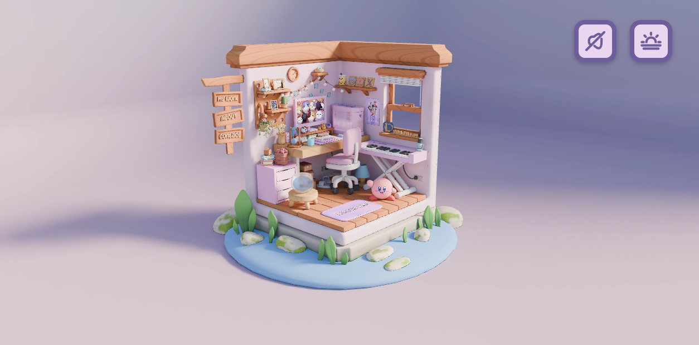
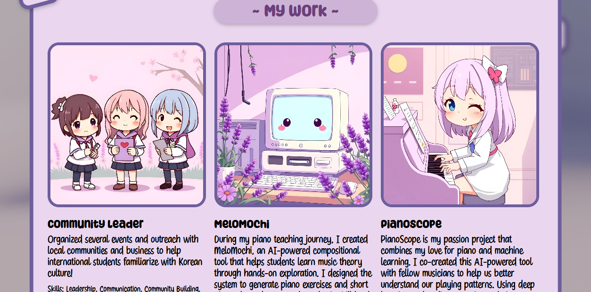
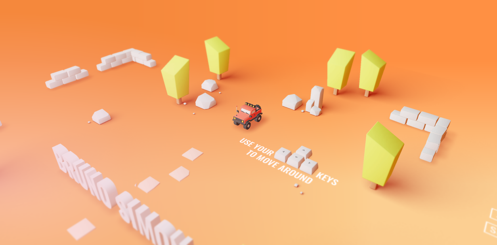
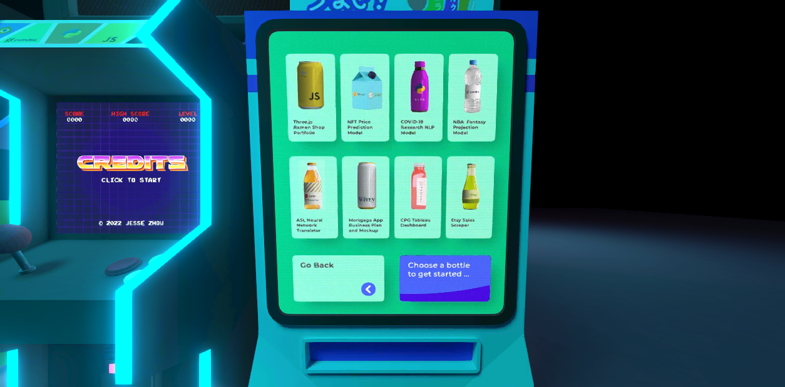
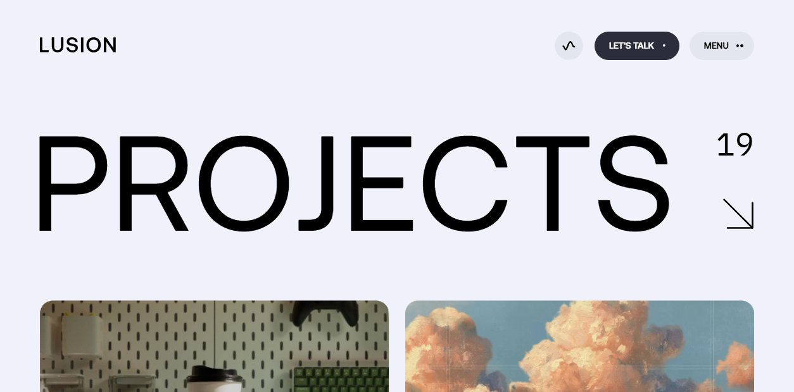

# 项目页 3D 重写研究

调研日期：2026-09-26。仓库基线：`752972ff3964e9e7bc177fceb94d2b5d4501718d`。

阶段：**研究与方向比较，尚未确定视觉稿，尚未实现页面**。本次只增加研究文档及案例观察截图，不改 `/projects`、项目文案、依赖和全站特效。

## 1. 先给结论

建议优先研究一座**可俯看的研究小屋**：用书架、工作桌和协作工具柜承载真实项目，点击物件后进入清楚的文字详情。这里的小屋应当让人看见“一个做拓扑研究、开发研究工具、参与开源协作的人”，而不只是泛用的程序员房间。

最值得组合的参考是：**Room Folio 的空间尺度和材质、Jesse’s Ramen 的物件导航和相机停靠、Bruno Simon 的一致交互语言、Lusion 的信息阅读层**。My Little Storybook 补充日式动画气质与克制叙事；Joshua’s World 用于比较“旅程”组织方式是否真的适合当前内容。

不要把获奖页面直接当生产模板。原作者公开代码中能看到命中抖动、窗口调整、移动端和资源管理上的取舍。应当借鉴它们的设计机制，并针对本站重新验证。

## 2. 研究方法与证据边界

本次把“3D 设计比赛”首先解释为 **可运行的 3D 网页与交互设计奖项**。这是因为目标是重写网站项目页，离线渲染大赛中的精美室内图不能证明浏览器交互、加载与导航成立。

检索范围包括 Awwwards 官方目录及作品页、作者公开 GitHub 仓库、Codrops 作者文章与作品原站。CSS Design Awards 的 Room Folio 页面返回 403，未据此确认具体奖项。未开展覆盖全部奖项平台的穷尽调查。

文中使用以下证据标记：

| 标记 | 含义                           | 不能据此推出什么                                                               |
| ---- | ------------------------------ | ------------------------------------------------------------------------------ |
| 奖项 | 官方作品页或年度目录明确标注   | 不能把 Honorable Mention 写成 SOTD，也不能把年度目录中的多个奖项混成唯一总冠军 |
| 实看 | 本次浏览器真正呈现并操作的状态 | 不是完整可用性评估、移动端验收或帧率测试                                       |
| 源码 | 阅读固定提交中的具体文件       | 不保证原站运行的就是该提交，也不证明当年获奖时的依赖版本                       |
| 作者 | 作者文章对自身制作过程的说明   | 自述加载时间、设备表现不等于本次测量                                           |
| 建议 | 将上述经验转化为本站方案       | 是待验证的设计选择，不是既有功能                                               |

Google 搜索出现验证页后，转用官方目录和作者链接。内置浏览器初始化失败后，使用 `vercel:agent-browser` 技能的独立浏览器会话完成观察。所有截图是本次实际页面状态，没有生成或补画参考图。

## 3. 本站实际内容与约束

依据 [项目内容](../../app/projects/ProjectsBoard.tsx)、[路由](../../app/projects/page.tsx)、[布局](../../app/layout.tsx)、[性能模式](../../components/FieldModeProvider.tsx)、[主题](../../components/ThemeProvider.tsx) 与 [依赖清单](../../package.json)。

| 当前项目                    | 当前对外叙述                                             | 空间表达需要保留的信息                                |
| --------------------------- | -------------------------------------------------------- | ----------------------------------------------------- |
| early-rumor-propagation-tda | 早期谣言传播树的拓扑特征构造与持久同调；论文在投         | 传播结构、拓扑分析、研究状态                          |
| topp                        | 高性能 bottleneck / Wasserstein 计算 Python 库；论文在投 | 持久图距离、匹配、Python 库；不可凭动效暗示新性能结论 |
| Iris-Terminal               | 本地优先 AI4MATH 工作台                                  | 研究工作空间，适合电脑与手稿的关系                    |
| ai-data-competitions-ui     | 面向学生竞赛的学院级服务网站                             | 校园、赛事组织、服务平台                              |
| open-ani/animeko            | CNN 验证码识别算法贡献                                   | 明确是参与上游项目的贡献                              |
| GUDHI/gudhi-devel           | 核心数学算法正确性修复与跨平台验证                       | 明确是算法修复与协作，区别于自己的完整产品            |

以上是**当前站点文案**，本次没有重新核验论文进度、上游贡献或性能。未来补内容时需回到相应仓库或论文证据。

当前页面是 4 张代表作品卡和 2 张开源贡献卡，链接均直达 GitHub；卡片已有焦点样式、鼠标倾斜和 reduced motion 分支。未来的 3D 层必须维持六个项目的完整可达性。

接入约束：

- 桌面已有 `#app-scroll-root` 内部滚动容器，`Navbar` 在其外；移动端保留文档滚动。不要把完整独立作品站的全局滚轮监听直接搬进来。
- `FieldScene` 已有多层画布。项目页新增 WebGL 必须测量与现有特效共同运行的成本，以及前景是否遮挡房间标签。
- `performanceMode` 当前只有 `normal | field`，它们是现有场景选择，**不是已实现的高、中、低画质档位**。
- 主题由 `ThemeProvider` 管理，播放器由 `MusicProvider` 管理。小屋的昼夜与音乐需共享现有状态。
- 当前依赖有 Three.js `^0.184.0`、React 19.2.4、Next.js 16.2.1、Framer Motion；**没有** `@react-three/fiber`、`@react-three/drei`。README 技术栈表中的旧描述不能替代当前依赖事实。

## 4. 候选作品与获奖核验

| 作品                                     | 官方确认                                                            | 重点研究                     | 本次证据深度                         |
| ---------------------------------------- | ------------------------------------------------------------------- | ---------------------------- | ------------------------------------ |
| [Bruno Simon Portfolio][bruno-award]     | SOTD，2019-11-11；Developer Award；[年度目录][annual]标记 SOTY 2019 | 玩具世界如何变成导航         | 2019 原站进入观察、源码              |
| [Joshua’s World][joshua-award]           | SOTD，2022-11-03                                                    | 沿岛屿发现经历与项目         | 奖项、原站 HTML；本次未进入岛屿      |
| [Lusion v3][lusion-award]                | SOTD，2023-10-02；Developer Award；[年度目录][annual]标记 SOTY 2023 | 强 3D 表现与项目阅读的分层   | 奖项、作者文章、当前原站导航         |
| [My Little Storybook][storybook-award]   | SOTD，2021-11-24；Developer Award                                   | 小尺度叙事与日式动画美术     | 奖项元素记录、作者文章               |
| [수아’s Room Folio][room-award]          | Honorable Mention，2025-02-10                                       | 可点击房间、昼夜、可玩细节   | 实际进入并点击 My Work、固定提交源码 |
| [Jesse’s Ramen — Portfolio][ramen-award] | Honorable Mention，2022-03-22                                       | 物件分区、镜头停靠、性能分级 | 点击 Projects 到售货机、固定提交源码 |

补充样本 [Choo-Choo World][choo-award] 是 Honorable Mention（2022-06-13），官方说明为在乡间自由搭建火车轨道，列出 WebGL、Three.js、Blender 等工具。它适合研究创作型玩具，但本站访客的主要任务是理解六个项目，不是建造世界，因此没有选为主要结构模板。

年度目录没有在这张汇总表中解释每个年度奖项的具体类别，本文只保留其公开 SOTY 标记，不进一步写成“唯一年度总冠军”。

## 5. 六个主案例拆解

### 5.1 Room Folio：房间真正成立的地方

原站：[sooahs-room-folio.com][room-live]。作者：Andrew Woan。



_实看，2026-09-26：选择无声进入后的桌面状态。作品与素材权利属于原作者；此截图用于分析，不作为本站素材。_

**空间与美术。** 房间切开两面，墙、桌面、地台组成一个完整剪影；大块浅色材质与暖木色统一了很多小物件。植物、杯子、靠垫等生活细节使它像住过的地方。主操作木牌挂在外缘，避免入口完全淹没在室内装饰中。这种“有边界的小世界”比无限场景更容易在一个屏幕里理解。

**入口与阅读。** 本次点击左侧 My Work 木牌，出现普通 HTML 项目弹层；文字可以读取，房间不承担长文排版。钢琴是额外的可玩细节，官方也以 working piano 介绍作品；本次没有验证每个琴键的音频表现。



_实看：点击三维木牌后的 My Work 内容层。截图的底部裁切是当时视口状态，不代表已完成长文滚动验收。_

**源码如何做。** 读取提交 `2a17ff26c980f6e33edfaea9300381198365a49a` 的 [main.js][room-code]、[README][room-readme] 和 [依赖][room-package]：

1. `PerspectiveCamera(35, ...)` 配合受限的 `OrbitControls`，限制水平转角、俯仰角和远近。它看起来像微缩模型，但并非正交相机。移动端另设起始相机与 target。
2. `GLTFLoader` 加 `DRACOLoader` 载入模型；不同模型名字参与材质、动画与交互分配。建模命名已经是程序接口的一部分。
3. `createMaterialForTextureSet` 使用昼、夜各四组纹理以及 `uMixRatio`，由 shader 混合两种状态。昼夜不只是给整个页面蒙上一层深色。
4. 鼠标坐标转为标准化坐标，`Raycaster` 对指定物件/命中代理做检测。命中后映射回原物件，播放动作或打开内容。
5. 打开 modal 时关闭 OrbitControls、清理悬停状态。内容层和场景层不能同时抢输入。
6. GSAP 做物件依次出现和弹性反馈；茶杯烟雾使用单独 shader。精力集中在少数能被看见的细节。

**最有用的失败经验。** README 明确说明：若悬停动画改变被射线检测物件的位置或大小，鼠标会不断“离开—进入”，形成抖动。作者用静态不可见 hitbox 和原网格混合检测处理，但也提示 hitbox 可能遮挡后面的物件。本站书本抽出动画必须与命中区域分离，并检查前后遮挡，不能只把命中盒无限放大。

README 还说明单一大 `main.js` 是教学取舍，以及 OGG 音频在 iPhone 上的问题。因此可借鉴资产流程和交互机制，不能整页搬运。作者在 [Codrops 访谈][andrew-spotlight]中也说明公开内容是隐私处理后的衍生版本；其中展示的项目不能拿来当真实商业产品案例论证。

**适合本站：** 小屋尺度、暖材质、边缘入口、昼夜氛围、点物件读 HTML 内容。

**需要调整：** 让书架、工作桌本身承载项目含义；中文长文使用本站可读排版；缩短首次入场；复用全站声音与主题；为每个热点提供键盘与文字入口。不要照抄粉紫配色和角色摆件。

### 5.2 Bruno Simon：交互动作就是作者身份

观察版本：[2019 原站][bruno-live]，而非默认域名可能已更新的作品。源码使用 `folio-2019` 当前公开提交，亦可能含获奖后的维护。



_实看，2026-09-26：进入后的操控教学区域。本次没有驾驶遍历全部项目。_

**为什么值得学。** 小车、地面路径、招牌、碰撞反馈都围绕“驾驶探索”同一个动作构建。用户不需要在每个区域重新理解一套交互语法；作品本身也展示作者处理 WebGL、交互与物理的能力。有限的橙、黄、白色和玩具尺度，使场景复杂度低于写实城市，同时风格更一致。

**源码证据。** 提交 `540f13573a6da282eae942a4c67335b97cd18970`：

- [Physics.js][bruno-physics] 用 Cannon 创建物理世界，设定重力、接触材质、车体等。车的手感与画面对象是分别处理的系统。
- [Camera.js][bruno-camera] 使用 40° 透视相机，处理目标、缩放和平移；不是默认的无限制模型查看器。
- [Areas.js][bruno-areas] 给交互区域单独准备 `mouseMesh`，通过 raycaster 和 `interact` 触发行为。鼠标移动标记更新需求，而不是遍历所有场景物件作为点击目标。
- [ProjectsSection.js][bruno-projects] 把项目图片、展板与区域组织起来。空间中的“项目位置”仍有普通项目数据作为依据。
- [Shadows.js][bruno-shadows] 根据物件位置、朝向等更新独立阴影网格，说明视觉阴影可以用有针对性的近似，而不必全部依赖昂贵的实时阴影。

这些是对公开源码的观察，不是“整个网站无实时灯光”或“性能一定更高”的结论。

**适合本站：** 一个统一动作贯穿所有热点；第一屏就教会操作；风格、内容和作者能力相互呼应；用受控视角减少无意义空间。

**不作为首选：** 驾车或 WASD 漫游会增加找项目的路径。当前六个项目尚无需要驾驶解释的共同主题。若研究小屋也要求用户先学移动、碰撞、转向才能看 Topp，导航成本就超过收益。

### 5.3 Jesse’s Ramen：把栏目变成真正的物件

原站：[jesse-zhou.com][ramen-live]。作者：Jesse Zhou。官方归类为 3D、Unusual Navigation、WebGL、Three.js、Blender。



_实看，2026-09-26：进入后点击 Projects 招牌，镜头移到售货机，屏幕出现项目瓶子、Go Back 和选择提示。本次未继续打开每个项目链接。_

**空间机制。** 它的启发不只是“赛博拉面馆很酷”，而是给不同内容找一个在空间内成立的容器。源码中的 `vendingMachine`、`aboutMe`、`credits` 分别有目标机位和交互区域；项目货架式选择有独立的 project hitbox、返回和进入按钮。物件是栏目入口，也是接下来交互的提示。

**源码证据。** 提交 `e838f02dc05fee1d685577ea7e71b635bfdf6364`：

- [Camera.js][ramen-camera] 分别 tween 相机位置与 OrbitControls target；转场时暂停旋转/缩放，转场后按内容恢复；竖屏和横屏使用不同距离。这比只把镜头坐标拉近更完整。
- [RayCaster.js][ramen-raycaster] 为标牌、售货机、具体项目选项设置 Box/Plane 命中代理；触屏有额外标牌命中盒。装饰模型与可点击区域明确分开。
- [PostProcessing.js][ramen-post] 将选定物件放入 bloom layer，分别渲染再合成。发光是有选择的，不是全画面模糊。
- [Performance.js][ramen-performance] 每 10 秒检查平滑后的帧率，且只在页面可见时按门槛移除反射、暂停视频、关闭 bloom：代码门槛分别涉及 40、30、20 fps。

最后一项是作者的**降级策略**，不是本次实测帧率，也不是建议本站直接采用这三个数字。源码用替换方法、移除对象等方式降级，生产接入还需设计幂等与资源释放。真正值得学的是：明确知道“哪种视觉成本可以先去掉”，保持主要内容可用。

**适合本站：** 书架/电脑/工具柜有各自机位；点击后留有返回；窄屏重新构图；按实际帧表现逐步减少装饰。

**需要调整：** 当前项目已有很长的英文仓库名和中文说明，不能全部做成三维面板贴图。选择对象后用普通文字层讲清工作、状态与链接。实时反射、多块视频屏和 bloom 不适合作为小屋的默认起点。

作者 Medium 案例文章本次返回 403，技术结论来自上述源码，未假装读到该文章。

### 5.4 Joshua’s World：让经历成为路线

原站：[joshuas.world][joshua-live]。官方说明是可探索 3D 岛屿，沿作者设计经历发现事实与项目，且收录了日夜切换交互。[奖项页][joshua-award]确认 Three.js。

**信息组织。** 原站 HTML 的内容次序是德国学习 Communication Design、毕业后做 motion designer、挪威硕士、在 Oslo 做 interaction designer，配合论文和近期项目链接。这是一条有先后的职业故事，因此“沿路探索”有语义基础。

**本次限制。** 浏览器首访及后续检查均停在 `LOADING...`，只观察到入口说明、导航与 `DRAG TO EXPLORE` 文案。没有完成岛屿拖动、热点点击，也没有找到并审阅其作者源码。不能据画面标签断言它用了 R3F、某种烘焙方案或某条镜头曲线。

**适合本站：** 日夜变化、分区有方向感、少量叙事节点。

**不宜直接迁移：** 本站六个项目目前按“代表作品/开源贡献”组织，缺少一条已经核实的时间叙事。把它们强排成一条长路线，反而会制造不真实的先后关系。若未来项目档案形成明确研究历程，再考虑岛屿或小镇。此次加载停留也提示：项目文字必须有独立于场景加载的入口；它不是对该站普遍故障的判断。

### 5.5 Lusion v3：展示再强，作品仍需要被读懂

参考 [2023 获奖页][lusion-award]及其中保存的 [Project Page][lusion-project-element]，并实看当前 [原站][lusion-live]。当前项目与文案持续更新，2026 截图不能当成 2023 原始版本截图。



_实看，2026-09-26：从菜单进入 `/projects`。这证明当前站点提供明确的普通项目列表，不证明其历史版本细节完全相同。_

**设计机制。** 3D 负责建立工作室表现力，导航和项目组织仍然直接。当前站有 Projects 入口、Featured Work、项目名称和工作类型；作者能力与具体交付物之间有清楚的连接。信息较多时，编辑式排版比把所有文字变成漂浮三维物件更容易浏览。

**可核实技术边界。** 官方保存了 reactive cursor、scroll animation、项目页等元素；[团队访谈][lusion-spotlight]说明其从头为不同项目制作相应系统，并维持内部 R&D。本文没有其 v3 完整作者源码，不给出虚构的 shader、物理库、模型压缩率或渲染管线。

**适合本站：** 三维世界与可快速扫描的项目目录并存；在文字层清楚呈现“我做了什么”，再给仓库链接。研究小屋旁边或下方保留“全部项目”会提高内容到达的确定性。

**尺度取舍。** 工作室的多项目制作系统不等于个人站需要同样的基础设施。本站优先做一个小场景、六个热点、一个详情呈现方式；不因此创建通用场景编辑器或全站空间路由框架。

### 5.6 My Little Storybook：风格化比昂贵写实更贴近本站

原站：[My Little Storybook][storybook-live]。[官方奖项页][storybook-award]说明是鸟一家过河的故事，概念受日本动画启发；工具列表含 Three.js、WebGL、GSAP、Lottie、Cinema 4D 和 Blender。[团队文章][lusion-spotlight]进一步说明其结合手工制作的 3D 环境、绘制动画与交互叙事，是为期一个月的内部实验。

**为什么相关。** 本站兼有数学研究与音乐、番剧兴趣，温暖、手作、微缩的空间可以接住这种气质。一个窗外的天空、柔和桌灯、略有使用痕迹的纸张，可能比全屋镜面反射更有身份感。

**叙事启发。** 给一个小范围场景设定清晰主题，再让少量动作强化主题。小屋可以让访客看到“手稿—工具—协作”的关系，而非塞满代表全部人生的装饰。可把书本轻轻抽出作为反馈，但长文阅读不必模拟每一次实体翻页。

**边界。** 本次依据官方元素记录及团队文章，未完成原站全流程交互，也未读取其完整源码。团队的一个月周期是该实验的自述，不是本站工期估计。故事适合顺序阅读，而项目目录需要直接跳转；因此更适合作为美术与节奏参考，不宜强制访客逐页解锁六个项目。

## 6. 优秀作品背后的制作流程

[Andrew Woan 的 Codrops 制作长文][museum-article]是本次技术补充资料，**不将这篇教程本身列为已核验获奖作品**。它公开了从参考收集到模型、烘焙、镜头与设备测试的完整链条。

### 6.1 先确定看什么，再决定做多少模型

作者先做 blockout，尝试空间结构和镜头能看到的内容，再制作细节。烘焙前沿预计的相机路线检查视野，删除无法看见的墙面和遮挡部分，优化 UV 排布。

对本站的意义：先让六个项目在灰模中都容易找到，再去做木纹、纸张和植物。若镜头只允许有限旋转，未出现的房屋背面可以简化；但不能删掉日后转场会露出的部分。场景规模由访问路径决定。

### 6.2 烘焙是在转移成本，不是消灭成本

把离线计算的光照写入贴图，可以让实时渲染保留很好的氛围；但大纹理增加下载、解码和显存成本。作者明确讨论了质量、加载与制作时间的交换，并比较 WebP 与 KTX。

以未压缩 RGBA8 的单张 2048×2048 纹理为例，基础像素约 16 MiB；完整 mip 链约 21.3 MiB。这个计算只是说明显存量级，**不是本站或案例实测显存**。文件下载只有几百 KB 也不能直接推出 GPU 占用同样小。双套昼夜纹理还会增加驻留成本。

建议先试“一套基础烘焙 + 少量可变发光/色调”，若昼夜表达不够再比较双套烘焙。静态家具尽量共用图集；需要独立动画或点选的书本、抽屉保留独立节点。几何压缩与纹理压缩是两个问题，Draco 不会自动解决大贴图。

### 6.3 精致感来自镜头、材质和细小动作的配合

作者用 `CatmullRomCurve3` 规划移动轨迹，插值相机位置，使用四元数处理朝向；并说明双曲线 look-at 和 Theatre.js 是其他工作流。他也展示了远景可以使用渲染后的平面贴图，而不必每一处都是真实高面数模型。

本站不需要马上采用轨迹编辑工具。固定全景加少数机位就可以验证方向。镜头 position 和 target 要一起过渡；书架遮挡、穿墙、窗口变化、反复点击中断，比“曲线很顺滑”更值得先解决。

### 6.4 输入与可读内容是另一半作品

3D 物件提供位置感，普通 HTML 提供文字、链接、键盘焦点和滚动。Raycaster 只解决“射线碰到谁”，不会自动解决浏览器可访问性、遮挡、误触或弹层焦点。

建议热点只参与一个有限列表；手指按下后拖动超过阈值应当算拖动而非点击；弹层出现时停用房间操作，关闭后恢复焦点。可交互物件需要稳定轮廓和名称提示，不能假设所有人都知道书脊可以点。

### 6.5 学习资料也有明确缺口

Codrops 作者说明该示例有一些仅在初始化时判断移动端的处理，调整窗口会破坏体验；他也提到一次 iOS 检查通过后，仍收到另一版本设备的问题反馈。因而“作者手机上流畅”不等于跨设备已经验证。本站需单独覆盖 Safari、WebGL context loss、后台恢复、旋转屏幕与重复进出路由。

## 7. 三个适合本站的方向

以下是定性比较，不是用户测试分数或工期承诺。

| 方向                | 具体形态                               | 与当前内容关系                     | 找项目的方式                     | 主要制作成本                         | 判断                               |
| ------------------- | -------------------------------------- | ---------------------------------- | -------------------------------- | ------------------------------------ | ---------------------------------- |
| A. 研究小屋         | 两面开放的微缩书房，书架/工作桌/协作柜 | 六个项目能自然对应真实物件         | 总览直接点六个热点，另有项目目录 | 原创场景、烘焙、热点布局、少数镜头   | **首选继续研究**                   |
| B. 桌上的立体研究册 | 一本摊开的书，每个跨页有小型 3D 展品   | 研究过程、图结构、工具可以作为章节 | 章节目录直接到达；翻页是附加表现 | 多页构图、转场、手机横竖屏           | 次选；更利于阅读，探索性较弱       |
| C. 研究岛/小镇      | 不同建筑分别代表研究、工具、社区       | 项目增多或有时间故事时更强         | 路线探索加地图/目录              | 地形、多个建筑、路径、相机、分区加载 | 当前六项内容不足以支撑其额外复杂度 |

## 8. 首选方向：研究小屋的可讨论设计稿说明

### 8.1 空间与美术

工作名称：**研究小屋 / The Study**，只是讨论标签。

想象一个靠窗的两面开放书房：左后方书架，中央工作桌，右侧协作工具柜。房间留出明显的地台和前方空白，使人一眼知道这是可探索的小模型。避免“整个房间只有一个整体悬浮动画，所有实际内容仍是外置卡片”。

美术建议采用暖木、米白纸张和墨蓝金属，少量青蓝作为研究仪器的提示色。白天是窗光和柔软阴影，夜间由桌灯、终端和柜内小灯建立层次。选择这种方向是为了衔接本站已有日夜和兴趣内容；最终颜色、材质与模型风格仍需看构图稿后确定。

可以有一本摊开的手稿、一杯茶、一株植物；有意控制无功能装饰数量。书脊上的长英文名不要求在远景可读，悬停或焦点提示用 HTML 显示完整名字。数学图形应来自正确的示意；没有对应数据时标注为示意，不把装饰曲线当研究结果。

### 8.2 六个项目如何变成物件

| 项目                        | 物件与位置建议                                 | 轻量反馈                       | 点击后内容                                               | 需要补齐的材料                         |
| --------------------------- | ---------------------------------------------- | ------------------------------ | -------------------------------------------------------- | -------------------------------------- |
| early-rumor-propagation-tda | 书架研究卷册，旁边一棵节点与边构成的小型传播树 | 节点沿树依次亮起，卷册轻微抽出 | 研究问题、方法、当前状态、仓库；有公开论文才增加论文入口 | 可公开的传播树示意、摘要和论文状态来源 |
| topp                        | 同一书架的第二本卷册或两组点的配对仪器         | 两组点之间显示配对线           | 距离类型、实现与使用场景、仓库；性能只引用真实基准       | 持久图配对示意、基准来源、使用示例     |
| Iris-Terminal               | 中央工作桌的终端电脑                           | 屏幕唤醒到静态项目预览         | 本地优先 AI4MATH 工作流、截图、仓库                      | 当前可公开截图与实际工作流             |
| ai-data-competitions-ui     | 桌侧或墙上的学院赛事公告板                     | 被选中的海报轻轻抬起           | 服务对象、赛事场景、个人职责、仓库                       | 平台截图、职责与状态说明               |
| GUDHI/gudhi-devel           | 右侧工具柜的算法校准工具/抽屉                  | 简短校准动作或标签高亮         | 修复了什么、如何验证、对应上游证据                       | 可公开 PR、测试或 issue 链接           |
| open-ani/animeko            | 同一协作柜中的小显示器/组件盒                  | 显示抽象图像识别示意           | CNN 相关贡献、所属上游项目、贡献证据                     | 贡献链接、可公开且无敏感内容的示意     |

“代表作品”和“开源贡献”依然要在文字层标清。工具柜的共同语义是参与已有系统的修补和扩展，不能让访客误以为 GUDHI、animeko 是本站作者独立开发的全部产品。不要在柜子上展示别人的奖杯，也不要给在投稿件添加“已发表”标志。

### 8.3 点书架到底发生什么

建议先用下面的流程验证，而非直接承诺整间屋子自由漫游：

1. **进入 `/projects`。** 标题和六项项目目录立即存在，房间区域先有静态预览；3D 加载后替换同位置预览。进入按钮只在声音或特别体验确有需要时出现，项目文字不被它挡住。
2. **发现入口。** 首屏至少看见书架、终端、协作柜的主要轮廓，并有“研究 / 工具 / 协作”简短提示。主要项目不藏在房间背面。
3. **悬停/焦点。** 书本轻微抽出、对象提亮，HTML 提示显示项目名和一句话。不可移动的命中区域避免来回抖动。触屏无需先完成 hover。
4. **点击具体项目。** 一次点击就能打开该项目详情；桌面允许镜头同时小幅靠近物件。不要先点书架、再找第二层书本、再第三次点确认才看内容。若点击书架空白区域，可以突出显示它的两本研究卷册，但不是必经步骤。
5. **阅读。** 桌面采用与房间并存的侧边内容面板，移动端采用正常可滚动的内容层。项目名、类别、当前说明、仓库链接是最低信息集合；缺少资料的字段不造内容。
6. **离开或返回。** 仓库链接是一次明确的后续点击；关闭详情回到原机位，焦点回到原热点。直接项目目录触发同一内容，不需要重新找物件。

这是待制作原型验证的状态关系：

```text
可读的项目目录 + 场景预览
  ├─ 资源可用 → 房间总览 → 选择项目 → 项目详情 → 回到总览
  ├─ 点项目目录 ───────────────────→ 项目详情
  └─ 加载失败 / 低性能 / 减少动态 → 静态场景 + 同一项目内容
```

未来可以采用 `/projects#topp` 这类稳定链接保存选择，但它是方案示例，当前路由未实现。实现时同步处理刷新、返回/前进、关闭详情与不存在的项目 ID，避免场景状态和 URL 脱节。

### 8.4 相机、手机和可访问性

- 第一轮比较正交相机与较长焦距透视相机的灰模画面。案例中的透视相机不应被误称为正交；本站最终选择以书脊与家具的可辨认性为依据。
- 默认固定三分之四视角，可有小幅鼠标视差；可选有限角度旋转。总览与少数机位足以开始，不先加入角色、碰撞和自由行走。
- 移动端需要重新安排相机与热点投影，而不只是把桌面房间缩小。若六个热点无法清楚显示，场景下方的项目目录始终是主要入口之一。
- 文字按钮与热点一一对应，键盘可直接访问；不能只给 canvas 加一个笼统的 `aria-label` 就声称可访问。
- 减少动态时取消相机飞行、弹性入场和循环装饰；操作反馈保留清楚的选中状态。
- 标签保持可读对比度；建议主操作有效触控区域至少 44×44 CSS px，并实际检查重叠和遮挡。这是设计目标，不是已通过检查。

## 9. 可行技术路线与工程边界

### 9.1 优先选择现有能力

先比较 **Blender → GLB + 烘焙贴图 → 现有 Three.js → React 文字层**。已有 Framer Motion 可用于 HTML 动效；少数相机和物件动作可以先在现有技术内完成。

R3F/Drei 可以作为备选，特别是在场景出现很多与 React 状态关联的独立对象时，但目前未安装。仅凭参考站使用它们，不足以给本项目增加依赖。Spline 可以帮助非程序设计者快速验证构图与热点，但引入其导出/runtime 前仍要检查加载、自托管、状态接入和可访问性；本轮没有对 Spline 做实机或产品能力评测。

本轮已阅读当前安装的 Next.js 16.2.1 指南 `node_modules/next/dist/docs/01-app/02-guides/lazy-loading.md`。未来保留服务端页面与可读内容，在客户端边界按需载入场景；需要 `ssr: false` 时必须放在 Client Component，不能直接加到 Server Component。对应 [公开指南][next-lazy]也列出这项限制。没有在本轮写入实现代码。

### 9.2 模型是最需要提前设计的接口

在 Blender 中明确地台原点、统一尺度、家具与相机可见范围；书本抽出的方向、抽屉轴心、屏幕平面和发光区域需要在建模时确定。项目物件、命中代理、静态装饰分别命名，但不为六个热点建立复杂注册框架。

资产清单至少应区分：房间壳体、静态家具、六个入口、可选装饰、烘焙图集、昼夜可变部分、静态预览。减少材质数和 draw calls 时，不能误合并需要单独选择的节点。纹理路径与解码器尽量同源，避免作品进入依赖额外海外服务。

Three.js [GLTFLoader][gltf-doc]可以接入 Draco、Meshopt 和 KTX2；[KTX2Loader][ktx-doc]需要检测渲染器支持的格式。这证明工具链有对应能力，不代表把所有压缩选项一起打开就是最优选择。先测下载、解码和画质再选。

### 9.3 与全站共存

| 现有系统                       | 需要解决的问题                | 未来接入原则                                                                 |
| ------------------------------ | ----------------------------- | ---------------------------------------------------------------------------- |
| 内部滚动容器                   | 全局滚轮控制会抢页面滚动      | 场景输入只作用于场景；内容阅读继续使用现有滚动模型                           |
| FieldScene 前后景              | 多画布 GPU/CPU 成本与标签遮挡 | 实测共同运行；必要时只在项目路由降低/暂停装饰，离开后恢复                    |
| `data-field-obstacle`          | 整页保护会吞掉大量可见空间    | 为实际内容面板/控件登记；场景与 Field 共存方式另行验证，不直接把整页标成障碍 |
| ThemeProvider                  | 两套日夜切换会产生冲突        | 房间使用同一主题状态；不要再建独立持久化主题                                 |
| MusicProvider / FloatingPlayer | 场景 BGM 与全站音乐叠播       | 不增加第二首自动 BGM；物件音效为可选，服从用户声音设置                       |
| 路由卸载                       | 材质、纹理、RAF、监听器泄漏   | 退出页面释放场景拥有的资源，取消动画和事件；处理后台暂停与 context loss      |

资产形式与授权同样需要规划。Room Folio 和 Bruno 的代码仓库有 MIT 声明，但第三方图片、声音、字体和商业材质不能自动视为同一授权。本站应优先原创建模，只迁移已明确许可的代码时再更新 [第三方说明](third-party-notices.md)。本 PR 未引入它们的代码、模型或声音。

## 10. 后续原型应验证什么

以下全部是**拟议门槛**，没有项目页运行测量支持，不能写进宣传文案作为已实现指标。

| 维度       | 第一轮目标                                                  | 验证办法                                                   |
| ---------- | ----------------------------------------------------------- | ---------------------------------------------------------- |
| 内容       | 六个现有项目全部可到达，状态/归属准确                       | 对照当前数据逐项走查，检查外链                             |
| 可发现性   | 不解释家具含义也能找到研究、工具、贡献                      | 邀请未看设计稿的人找指定项目，记录路径与误点               |
| 交互路径   | 从总览一次选择能看项目，再一次可打开仓库                    | 鼠标、触屏、键盘分别完成；检查取消和返回                   |
| 内容独立性 | 场景下载失败仍可读六项内容                                  | 阻断 GLB/纹理请求并检查内容与链接                          |
| 初始资产   | 场景首次传输暂以 4 MiB 为预算起点，含必要模型/纹理/解码资源 | 冷缓存 Network 实测；预算不含已有页面资源，整体也单独报告  |
| 渲染复杂度 | 暂以 100k 可见三角形、80 draw calls 为灰模后上限起点        | `renderer.info` + 实际设备记录；数字可调整，不能代替帧时间 |
| 流畅性     | 桌面目标 60 fps，移动端目标稳定 30 fps                      | 明确设备/浏览器/视口/画质，记录稳定阶段帧时间分位数和卡顿  |
| 降级       | 先减分辨率、装饰与后处理，必要时静态预览                    | 模拟低性能、后台恢复；每次降级保持内容与选择可用           |
| 稳定性     | resize、横竖屏、重复进出、context loss 都可恢复             | 真实浏览器操作，观察资源与监听器是否持续增长               |
| 可访问性   | 键盘与 reduced motion 均可完成查找                          | 焦点顺序、返回焦点、文字对比度、触控命中范围实查           |

4 MiB、面数和 draw calls 只是协助控制制作规模的初始预算。贴图解码、DPR、特效和全站并发场景都可能改变表现，不能凭资源数量宣称体验达标。不开真实全站页面测试，单独的小屋 demo 也不能代表最终性能。

建议的下一阶段顺序：

1. 确认方向 A/B/C，并挑选暖木书房、偏实验室或更强日式手作的视觉倾向；当前偏向 A，但仍可修改。
2. 先做 2–3 张构图草案和静态灰模，标出六个对象、镜头与文字面板。此时不做正式模型细节。
3. 用同一个代表项目完成“预览—选择—详情—返回”最小原型，比较桌面与手机；做性能预算初测。
4. 灰模交互成立后，再制作原创模型、烘焙、昼夜与少量装饰动作，接入剩余项目。

当前仍缺：最终构图与模型风格、是否需要明显的相机靠近、项目详情的真实素材、移动端实测，以及房间与 Field 共存的负载证据。**本轮完成研究，不提前把这些选择视为已获确认。**

## 11. 本轮检查记录

- 已读仓库规则、README、项目文档、项目页与相关布局/主题/性能源码；根据实际 Git remote 在 `proffitteoy/nothing-new` 建立研究分支。
- 已核实六个主案例的 Awwwards 奖项层级；读取三个公开项目的固定提交源码，另有作者制作长文和团队访谈。
- 实际完成 Room Folio 无声进入与 My Work 点击、Bruno 2019 进入教学区域、Lusion 菜单到项目列表、Jesse 点击 Projects 后进入售货机；Joshua 入口停留已明确记录。
- 35 个外部引用复查均返回 HTTP 200；引用标识完整，本地源码/文档链接和五张截图路径有效，UTF-8 文本无 NUL。Markdown 通过 Prettier，暂存差异通过 `git diff --cached --check`。
- 此变更为文档研究，不运行应用测试或生产构建，不宣称页面实现、跨设备或性能验收完成。

## 12. 来源与复查入口

奖项与作品：

- [Awwwards 年度作品目录][annual]；[Three.js 作品目录][three-gallery]。访问日期均为 2026-09-26。
- [Bruno Simon 官方奖项][bruno-award] / [2019 作品][bruno-live]。
- [Joshua’s World 官方奖项][joshua-award] / [作品][joshua-live]。
- [Lusion v3 官方奖项][lusion-award] / [奖项页保存的项目页面元素][lusion-project-element] / [当前作品站][lusion-live]。
- [My Little Storybook 官方奖项][storybook-award] / [作品][storybook-live]。
- [Room Folio 官方奖项][room-award] / [作品][room-live]。
- [Jesse’s Ramen 官方奖项][ramen-award] / [作品][ramen-live]。
- [Choo-Choo World 官方奖项][choo-award]，仅作为补充比较。

一手制作资料：

- [Andrew Woan：Developer Spotlight][andrew-spotlight]，2025-05-15：作品来源、工具和创作动机。
- [Andrew Woan：3D World in the Browser with Blender and Three.js][museum-article]，2025-04-08：blockout、模型、UV、烘焙、压缩、相机、R3F 与移动端限制。
- [Lusion：Where Digital Craft Meets Ambitious Experimentation][lusion-spotlight]，2026-04-13：团队实践与 Storybook 制作背景。
- Room Folio 固定提交 `2a17ff2`：[主文件][room-code]、[README 已知问题][room-readme]、[依赖][room-package]。原仓库 `sooahkimsfolio` 链接目前跳转到 `sooahs-room-folio`。
- Bruno 固定提交 `540f135`：[Physics][bruno-physics]、[Camera][bruno-camera]、[Areas][bruno-areas]、[ProjectsSection][bruno-projects]、[Shadows][bruno-shadows]、[MIT][bruno-license]。
- Jesse 固定提交 `e838f02`：[Camera][ramen-camera]、[RayCaster][ramen-raycaster]、[Performance][ramen-performance]、[PostProcessing][ramen-post]。

本地五张截图只截取分析需要的界面状态，均有相邻说明与原站链接。它们是研究引用，不授权在最终页面复用作品的美术资源。

[annual]: https://www.awwwards.com/websites/sites_of_the_year/
[three-gallery]: https://www.awwwards.com/websites/three-js/
[bruno-award]: https://www.awwwards.com/sites/bruno-simon-portfolio
[bruno-live]: https://2019.bruno-simon.com/
[joshua-award]: https://www.awwwards.com/sites/joshuas-world
[joshua-live]: https://www.joshuas.world/
[lusion-award]: https://www.awwwards.com/sites/lusion-v3
[lusion-live]: https://lusion.co/
[lusion-project-element]: https://www.awwwards.com/inspiration/project-page-lusion-v3
[storybook-award]: https://www.awwwards.com/sites/my-little-storybook
[storybook-live]: https://exp-my-little-storybook.lusion.co/
[room-award]: https://www.awwwards.com/sites/suas-room-folio
[room-live]: https://www.sooahs-room-folio.com/
[ramen-award]: https://www.awwwards.com/sites/jesses-ramen-portfolio
[ramen-live]: https://www.jesse-zhou.com/
[choo-award]: https://www.awwwards.com/sites/choo-choo-world
[andrew-spotlight]: https://tympanus.net/codrops/2025/05/15/developer-spotlight-andrew-woan/
[museum-article]: https://tympanus.net/codrops/2025/04/08/3d-world-in-the-browser-with-blender-and-three-js/
[lusion-spotlight]: https://tympanus.net/codrops/2026/04/13/lusion-where-digital-craft-meets-ambitious-experimentation/
[room-code]: https://github.com/andrewwoan/sooahs-room-folio/blob/2a17ff26c980f6e33edfaea9300381198365a49a/src/main.js
[room-readme]: https://github.com/andrewwoan/sooahs-room-folio/blob/2a17ff26c980f6e33edfaea9300381198365a49a/README.md
[room-package]: https://github.com/andrewwoan/sooahs-room-folio/blob/2a17ff26c980f6e33edfaea9300381198365a49a/package.json
[bruno-physics]: https://github.com/brunosimon/folio-2019/blob/540f13573a6da282eae942a4c67335b97cd18970/src/javascript/World/Physics.js
[bruno-camera]: https://github.com/brunosimon/folio-2019/blob/540f13573a6da282eae942a4c67335b97cd18970/src/javascript/Camera.js
[bruno-areas]: https://github.com/brunosimon/folio-2019/blob/540f13573a6da282eae942a4c67335b97cd18970/src/javascript/World/Areas.js
[bruno-projects]: https://github.com/brunosimon/folio-2019/blob/540f13573a6da282eae942a4c67335b97cd18970/src/javascript/World/Sections/ProjectsSection.js
[bruno-shadows]: https://github.com/brunosimon/folio-2019/blob/540f13573a6da282eae942a4c67335b97cd18970/src/javascript/World/Shadows.js
[bruno-license]: https://github.com/brunosimon/folio-2019/blob/540f13573a6da282eae942a4c67335b97cd18970/license.md
[ramen-camera]: https://github.com/enderh3art/Ramen-Shop/blob/e838f02dc05fee1d685577ea7e71b635bfdf6364/src/Experience/Camera.js
[ramen-raycaster]: https://github.com/enderh3art/Ramen-Shop/blob/e838f02dc05fee1d685577ea7e71b635bfdf6364/src/Experience/RayCaster.js
[ramen-performance]: https://github.com/enderh3art/Ramen-Shop/blob/e838f02dc05fee1d685577ea7e71b635bfdf6364/src/Experience/Performance.js
[ramen-post]: https://github.com/enderh3art/Ramen-Shop/blob/e838f02dc05fee1d685577ea7e71b635bfdf6364/src/Experience/PostProcessing.js
[next-lazy]: https://nextjs.org/docs/app/guides/lazy-loading
[gltf-doc]: https://threejs.org/docs/pages/GLTFLoader.html
[ktx-doc]: https://threejs.org/docs/pages/KTX2Loader.html
