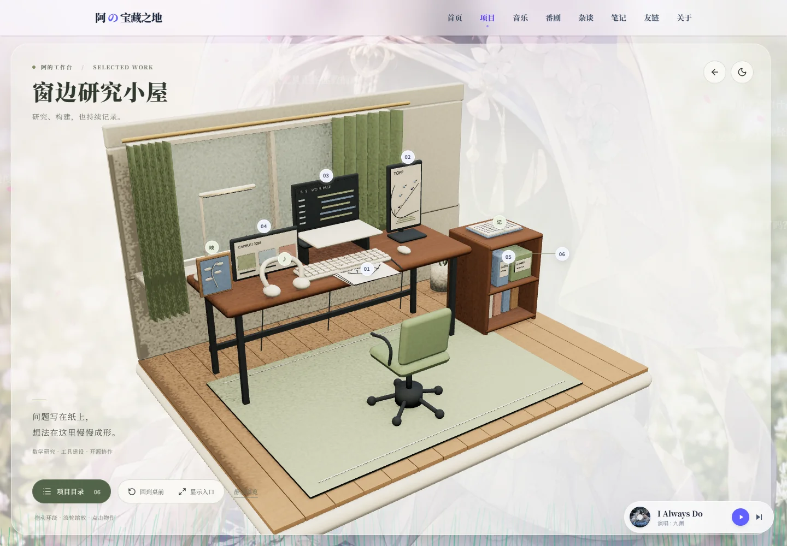
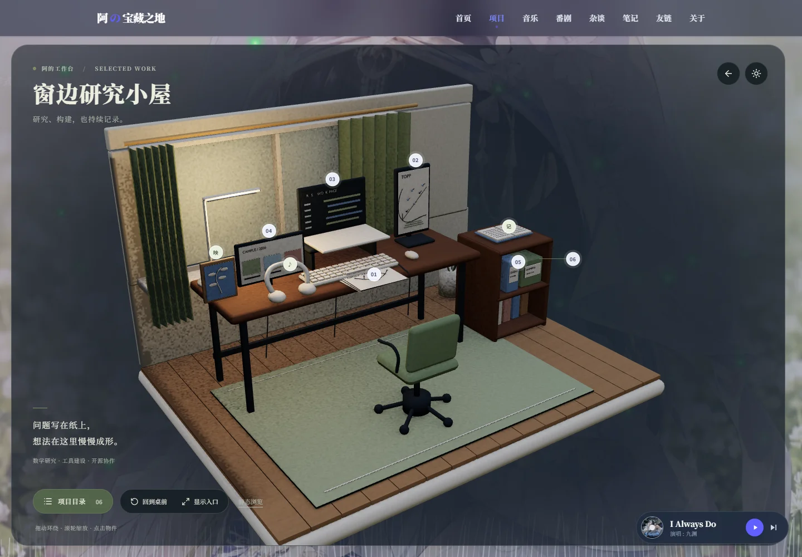
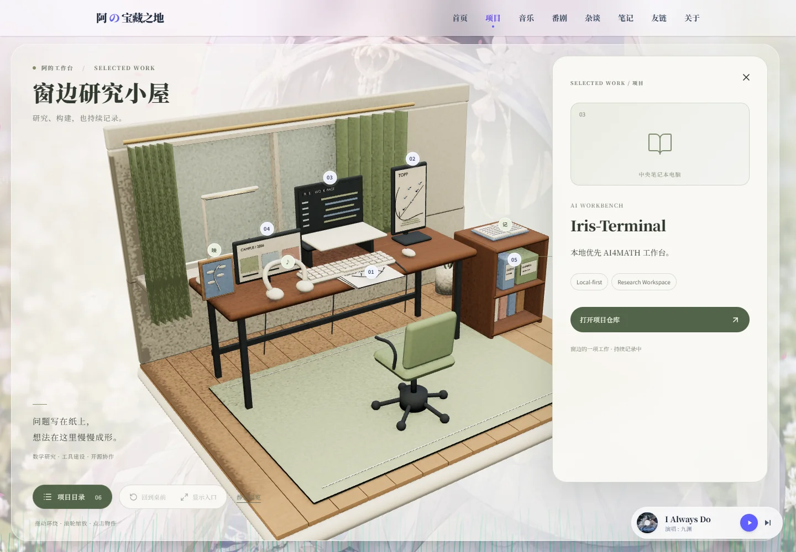
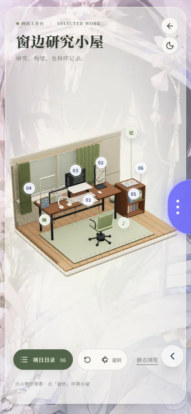

# 窗边研究小屋

`/projects` 将六个项目放进可环绕的窗边工作台，延续首页「研究、构建，也持续记录」的表达。布局参考作者提供的真实工作环境：深木桌、绿帘、中央架高的电脑、左右横竖屏、纸张、白色键鼠与耳机；右侧增加低书架，安放开源协作档案。原始私人照片没有进入仓库或网页。

获奖案例、奖项层级与制作方法的原始证据仍在 [3D 研究文档](projects-3d-research.md)。本文记录实现结果，研究文档中的历史研究状态不代表当前实现状态。

## 内容与交互

| 物件       | 内容                        | 行为                         |
| ---------- | --------------------------- | ---------------------------- |
| 手稿       | early-rumor-propagation-tda | 轻抬纸张，传播树节点依次亮起 |
| 竖屏       | Topp                        | 持久图配对示意，选择时提亮   |
| 中央电脑   | Iris-Terminal               | 本地工作区示意，选择时提亮   |
| 横屏       | 学院竞赛平台                | 赛事信息示意，选择时提亮     |
| 算法档案册 | GUDHI 贡献                  | 档案册轻微抽出               |
| 识别档案盒 | animeko 贡献                | 档案盒轻微抽出               |
| 独立笔记本 | 笔记                        | 进入已有 `/blog` 路由        |
| 相框       | 番剧                        | 进入已有 `/anime` 路由       |
| 耳机       | 桌边音乐                    | 打开控制面板，复用全站播放器 |

六个项目的说明、仓库和论文状态从原页迁移，GUDHI/animeko 明确属于开源贡献。屏幕和纸上的图形是原创解释性示意，不是项目截图、实测数据或已发表成果。

桌面拖动环绕、滚轮缩放，提供「回到桌前」「显示入口」；相机有俯仰与距离限制，近侧墙面淡出。物件与 HTML 热点都能单次打开详情，详情开启时暂停场景操作，Esc/关闭恢复焦点。入口命中区域至少 44×44 CSS px，投影相邻时错开并用细线指回物件，遮挡检测隐藏不可见入口。

手机默认保留纵向页面滚动，主动点「旋转」才启用环绕及双指缩放。项目目录包含原生展开控件、说明与真实仓库链接，预渲染后即存在；模型失败、WebGL 不可用或用户选择静态浏览时仍可访问全部内容。

## 全站接入与资源生命周期

- 标题继承站内宋体，背景、导航、圆角半透明阅读面板和悬浮播放器延续现有样式。
- 日夜只读取 `ThemeProvider`，音乐只使用 `MusicProvider`，没有第二套音频播放实例。
- 沿用桌面 `app-scroll-root` 与移动端文档滚动，不在 window 上接管滚轮。
- 3D 就绪时设置临时 `data-project-room-active`；Field 保留后景，前景粒子与交互波纹停止绘制，静态浏览或离开页面立即恢复。
- Three.js 与 GLTFLoader 在客户端边界加载，无新增运行时依赖。静止时停止场景 RAF，页面后台暂停；卸载释放几何、材质、纹理、监听器和 WebGL renderer。
- React Strict Mode 会复用 canvas，只有 canvas 实际脱离文档后才强制释放 context，避免旧实例的异步 context-loss 事件杀死替代实例。
- GLB 请求有 20 秒超时，可切静态或重试；context loss 进入同一可读降级状态。

## 可编辑资产与重建

模型、材质、示意屏幕与小幅植物插画由本项目制作，没有复制获奖作品的模型、图片、声音或代码。资产遵循本仓库许可证。保留 [Blender 源文件](../../design/projects-room/study.blend)、[烘焙图集](../../design/projects-room/study-atlas.png) 与 [建模脚本](../../scripts/build-project-room.py)。

工具版本：Blender **4.5.9 LTS**，Node **22.23.3**；Blender 来自官方便携发行包，并核对官方 SHA-256。依赖由本仓库 lockfile 安装。

```powershell
# 在仓库根目录；blender 指向本机 Blender 4.5 LTS 可执行文件。
blender -b --python scripts/build-project-room.py
node scripts/encode-project-room.mjs
```

脚本生成开顶房间、完整家具背面、九个交互物件及对应 `anchor_*`。统一 UV 后烘焙颜色和环境遮蔽，导出自包含 GLB，随后用同一个场景渲染日间、夜间、详情构图和手机构图；第二条命令编码为 WebP。每次重建后运行资产测试，保证 React 目录与模型命名没有漂移。

交互按组保留，颜色/AO 共享一张 2048² 图集。当前 GLB 为 **3,480,204 bytes（3.32 MiB）**，日间预览 **66,612 bytes**。资产测试约束 GLB 不超过 4 MiB、所有几何少于 100k 三角形、primitive 少于 80；这些是资源规模检查，不等于网络或帧率验收。

## 验证记录

日期：2026-09-27。Node 22.23.3 / Windows；浏览器为 Headless Chrome **154**，GPU 为 **Intel Arc / ANGLE Direct3D11**。手机项目表示同一机器上的窄屏仿真，不能替代真机结果。

| 检查                                | 结果                                                                      |
| ----------------------------------- | ------------------------------------------------------------------------- |
| 类型检查、改动文件 ESLint、Prettier | 通过                                                                      |
| Node 测试                           | 70 项通过，包含 GLB 契约及前后景独立暂停断言                              |
| 完整生产构建                        | 通过，245 个静态页面；保留原有 KaTeX 中文数学警告                         |
| 六个项目与详情                      | 全部可打开，仓库链接和贡献归属正确                                        |
| 键盘/减少动态                       | 焦点进入详情、Esc 返回入口；减少动态仍可操作                              |
| 环绕与 resize                       | 拖动到房间背后，近侧墙面隐藏；恢复桌前、桌面切换手机视口通过              |
| 手机布局                            | 390×844 下九个热点无重叠，无横向页面溢出；旋转开关恢复 pan-y              |
| 音乐                                | 耳机打开共享控制面板；页面只有一个 audio 实例                             |
| 模型请求失败                        | 阻断 GLB 后显示静态图与六项目录，解除阻断可重试                           |
| WebGL context loss                  | 模拟丢失后降级，重试恢复 3D                                               |
| 重复挂载                            | 连续三轮静态/3D 切换，每次卸载后无残留场景 canvas                         |
| Field 共存                          | 小屋中前景/交互层非透明像素均为 0，后景继续；进入笔记后前景恢复且场景卸载 |
| 桌面滚动                            | 进入笔记后文档 scrollY 仍为 0，使用原有内部滚动                           |

生产版本在 1440×1000、DPR 1、normal 模式下，通过持续微幅滚轮缩放触发渲染，预热 0.5 秒后采样 3 秒。以场景实际提交绘制后的 DOM 诊断更新采集间隔：109 次绘制，约 **36.2 fps**，间隔 P50 **29.5 ms**、P95 **36.3 ms**、最大 **39.8 ms**。静止 0.6 秒观察到 **0 次额外绘制**；默认视角为 **44,584 三角形 / 12 draw calls**。

**桌面 60 fps 目标尚未达到。** 此记录是一次本机生产版本采样，不是全设备性能保证；没有将窄屏仿真写成真实手机 30 fps 验收。真实移动端 Safari、其他 GPU、冷缓存网络传输与后台恢复仍需补充实机验证。静态入口始终可用。本地构建没有 Blob 凭据，构建脚本按既有规则跳过图片上传。

## 交付画面

日间：



夜间：



项目详情：



手机：


