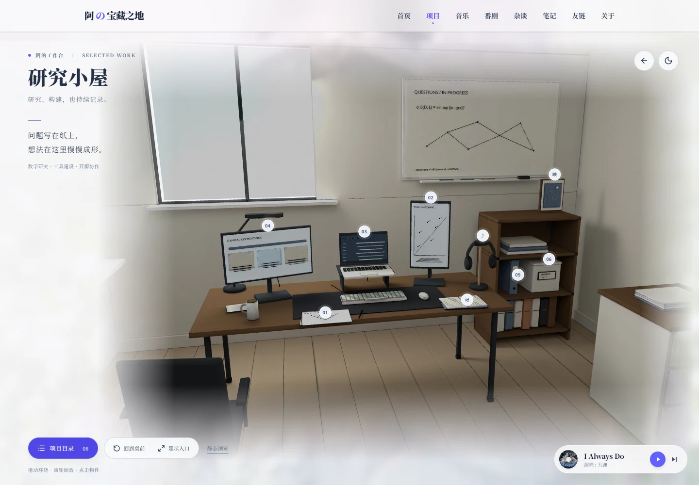
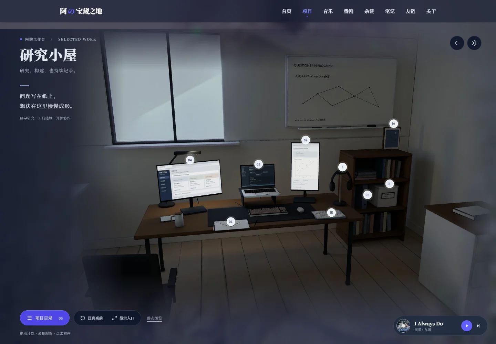
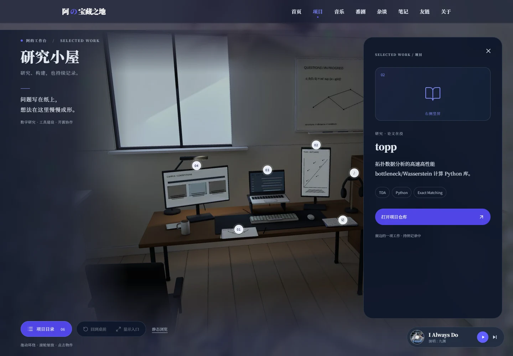
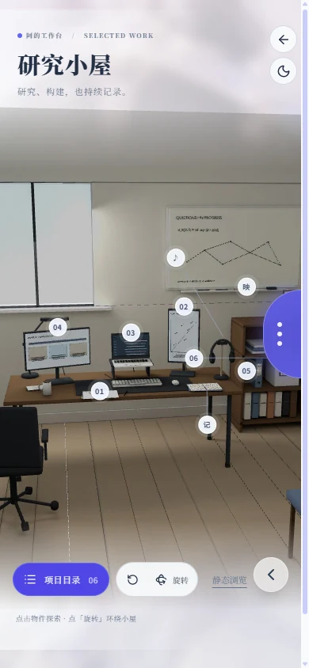
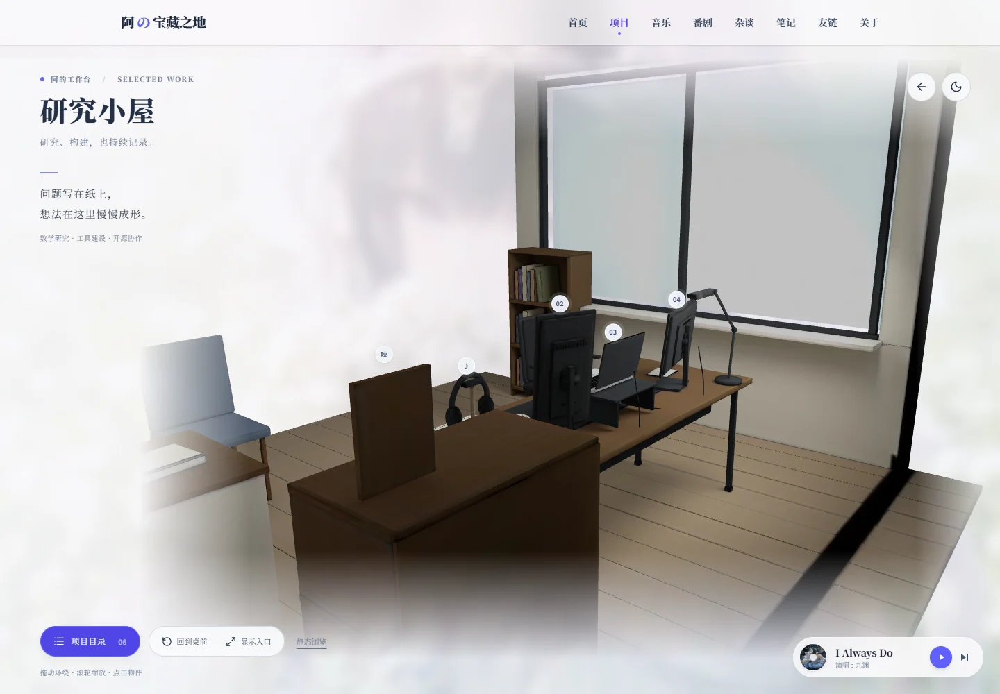
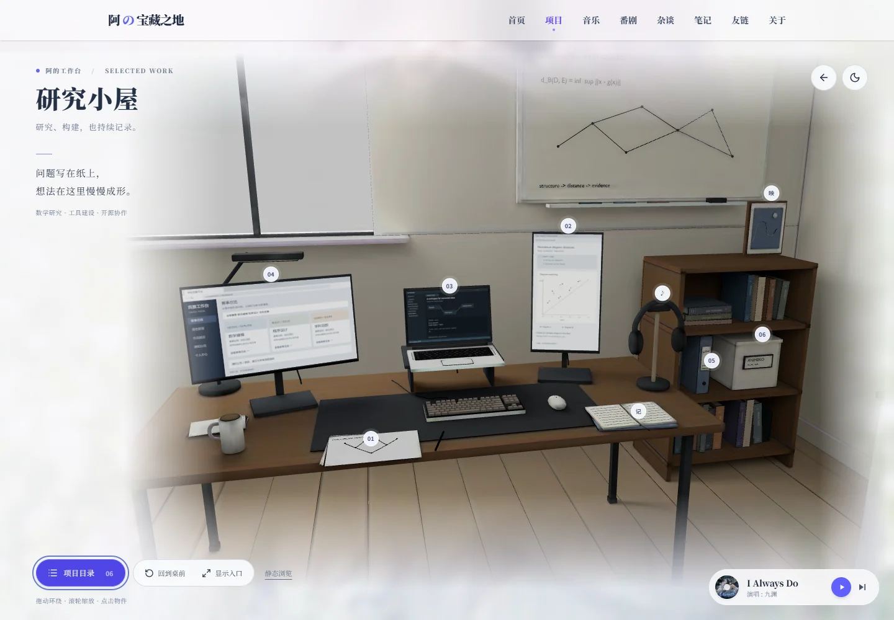

# 窗边研究小屋

`/projects` 将六个项目放进可环绕的研究工作间，延续首页「研究、构建，也持续记录」的表达。当前版本按真实尺度建模：74 cm 高、2.05 m 宽的胡桃木桌面，薄边框屏幕、键鼠、纸张和桌侧耳机架。左右副屏分别向中央内倾 15° / 17°，面板另有 6° / 5° 后仰；中央电脑的外壳、显示面和摄像头一起沿铰链后仰 12°。

照片只提供生活线索，空间布局重新设计：取消绿帘、厚地台和微缩比例，在后墙增加窗户与研究白板；左侧设阅读书架，右侧设资料柜与软木记录板，身后设阅读座椅和落地灯。家具背面完整，三面墙按观察方向淡出，环绕时可以看到各方向的内容。原始私人照片没有进入仓库或网页。

页面移除独立的大圆角舞台，以共享背景、宋体、靛蓝控件和半透明阅读层接入全站。初始视角从桌前自然俯看工作面；外围背景适度虚化，减少图案与文字对场景的干扰。
获奖案例、奖项层级与制作方法的原始证据仍在 [3D 研究文档](projects-3d-research.md)。本文记录实现结果，研究文档中的历史研究状态不代表当前实现状态。

## 内容与交互

| 物件       | 内容                        | 行为                         |
| ---------- | --------------------------- | ---------------------------- |
| 手稿       | early-rumor-propagation-tda | 轻抬纸张，传播树节点依次亮起 |
| 竖屏       | Topp                        | 持久图配对示意，选择时提亮   |
| 中央电脑   | Iris-Terminal               | 本地工作区示意，选择时提亮   |
| 横屏       | 学院竞赛平台                | 赛事信息示意，选择时提亮     |
| 算法档案册 | GUDHI 贡献                  | 档案册轻微抽出               |
| 识别档案盒 | animeko 贡献                | 档案盒轻微抽出               |
| 独立笔记本 | 笔记                        | 进入已有 `/blog` 路由        |
| 相框       | 番剧                        | 进入已有 `/anime` 路由       |
| 耳机       | 桌边音乐                    | 打开控制面板，复用全站播放器 |

六个项目的说明、仓库和论文状态从原页迁移，GUDHI/animeko 明确属于开源贡献。屏幕和纸上的图形是原创解释性示意，不是项目截图、实测数据或已发表成果。显示器包含薄边框、后壳、散热口、连接口和支架铰链；三块 LCD 分别使用学院竞赛后台、Iris 工作区与 Topp 配对笔记的清晰界面示意。

外接键盘按 19.05 mm 键距建立 87 键 ANSI 布局，包含错位字母行、功能区、独立方向区、6.25u 空格、不同宽度修饰键、键帽斜裙与浅凹顶面、F/J 定位条及字印。笔记本使用独立的低矮键盘、铰链、触控板和扬声器孔。

两侧与右后方共放置 36 本书：每本都有封皮、书脊、内缩纸页和学科标题，按书挡成组竖放，并搭配横放书堆、少量倾斜和前后错落。GUDHI 档案册另有封皮和纸芯；animeko 仍保留原有档案盒归属。书脊是自制学科标识，没有使用真实出版物封面。

桌面拖动环绕、滚轮缩放，提供「回到桌前」「显示入口」；相机有俯仰与距离限制，近侧墙面淡出。物件与 HTML 热点都能单次打开详情，详情开启时暂停场景操作，Esc/关闭恢复焦点。入口命中区域至少 44×44 CSS px，投影相邻时错开并用细线指回物件，遮挡检测隐藏不可见入口。

手机默认保留纵向页面滚动，主动点「旋转」才启用环绕及双指缩放。项目目录包含原生展开控件、说明与真实仓库链接，预渲染后即存在；模型失败、WebGL 不可用或用户选择静态浏览时仍可访问全部内容。

## 全站接入与资源生命周期

- 标题继承站内宋体，背景、导航、圆角半透明阅读面板和悬浮播放器延续现有样式。
- 日夜只读取 `ThemeProvider`，音乐只使用 `MusicProvider`，没有第二套音频播放实例。
- 沿用桌面 `app-scroll-root` 与移动端文档滚动，不在 window 上接管滚轮。
- 3D 就绪时设置临时 `data-project-room-active`；Field 保留后景，前景粒子与交互波纹停止绘制，静态浏览或离开页面立即恢复。
- Three.js 与 GLTFLoader 在客户端边界加载，使用 three-mesh-bvh 建立拾取索引。静止时停止场景 RAF，页面后台暂停；卸载释放几何、材质、纹理、监听器和 WebGL renderer。
- React Strict Mode 会复用 canvas，只有 canvas 实际脱离文档后才强制释放 context，避免旧实例的异步 context-loss 事件杀死替代实例。
- GLB 请求有 20 秒超时，可切静态或重试；context loss 进入同一可读降级状态。

## 可编辑资产与重建

模型、材质、示意屏幕与小幅植物插画由本项目制作，没有复制获奖作品的模型、图片、声音或代码。资产遵循本仓库许可证。保留 [Blender 源文件](../../design/projects-room/study.blend)、[烘焙图集](../../design/projects-room/study-atlas.png)、[细节原图](../../design/projects-room/study-details.png)、[键位与图集坐标](../../design/projects-room/study-details.json) 与 [建模脚本](../../scripts/build-project-room.py)。

当前默认烘焙为 32 samples，可通过 `ROOM_BAKE_SAMPLES` 调整；细节文字不依赖增加采样数量来保持清晰。

工具版本：Blender **4.5.9 LTS**，Node **22.23.3**；Blender 来自官方便携发行包，并核对官方 SHA-256。依赖由本仓库 lockfile 安装。

```powershell
# 在仓库根目录；blender 指向本机 Blender 4.5 LTS 可执行文件。
node scripts/encode-project-room.mjs --surfaces
blender -b --python scripts/build-project-room.py
node scripts/encode-project-room.mjs
```

脚本生成真实尺度工作间、完整家具背面、九个交互物件及对应 `anchor_*`。统一 UV 后在 Cycles 中分别烘焙日间窗光与夜间台灯的直接光、间接光、表面色及屏幕自发光，离线降噪后导出 GLB 和夜间 JPG，随后用同一个场景渲染日间、夜间、详情及手机日夜构图；最后一条命令编码为 WebP。第一条命令以 SVG/Sharp 重建原创屏幕、键帽字印和书脊，不请求外部素材。每次重建后运行资产测试，保证 React 目录与模型命名没有漂移。

交互按组保留，日夜各用一张 4096² 图集：左上角保留经 OpenImageDenoise 离线降噪的 3072² 房间光照；右侧和底部保留高分辨率屏幕、键帽字印与书脊。印刷表面乘以烘焙的局部光照，LCD 保留自发光；小键帽合并同一键盘的光照采样，并为顶面、斜裙和侧面保留稳定色阶，避免亚像素 UV 岛形成脏色块；文字区域不经过降噪，以免被抹成色块。所有物件仍使用同一张图集和无光照材质，不增加运行时字体或屏幕绘制。GLB 内嵌日间贴图并声明 `KHR_materials_unlit`，夜间图由同一路由资源单独加载；Three.js 直接显示烘焙结果，避免重复照明。默认视角与预览图使用相同表面与近似相机参数。运行时没有实时阴影或后处理。无光照模型导出时省去不用的法线属性，Blender 源文件保留材质与建模法线。图集边长由 3072 增至 4096，GPU 纹理占用因此增加；下载体积、三角形与 draw call 预算继续由资产测试约束。

开场期间预解析一份模型，为各组建立局部坐标的静态 BVH；每次投影或点击只变换射线，保持物件微动后的命中与遮挡正确。相比逐标签遍历全部三角形，这减少了观察操作的 CPU 开销。挂载后的模型、两张光照贴图、BVH、ImageBitmap 和监听器都随路由卸载释放。未使用的预解析模型最多保留 60 秒；仅压缩源文件在标签页内复用。加载优化实测见 [全站启动与导航](site-startup.md)。

资产测试将 **GLB 与夜间贴图之和**限制在 4 MiB 内，全部几何少于 100k 三角形、primitive 少于 80；这些是资源规模检查，不等于网络或帧率验收。

## 首版历史验证（PR #37）

日期：2026-09-27。Node 22.23.3 / Windows；浏览器为 Headless Chrome **154**，GPU 为 **Intel Arc / ANGLE Direct3D11**。手机项目表示同一机器上的窄屏仿真，不能替代真机结果。

| 检查                                | 结果                                                                      |
| ----------------------------------- | ------------------------------------------------------------------------- |
| 类型检查、改动文件 ESLint、Prettier | 通过                                                                      |
| Node 测试                           | 70 项通过，包含 GLB 契约及前后景独立暂停断言                              |
| 完整生产构建                        | 通过，245 个静态页面；保留原有 KaTeX 中文数学警告                         |
| 六个项目与详情                      | 全部可打开，仓库链接和贡献归属正确                                        |
| 键盘/减少动态                       | 焦点进入详情、Esc 返回入口；减少动态仍可操作                              |
| 环绕与 resize                       | 拖动到房间背后，近侧墙面隐藏；恢复桌前、桌面切换手机视口通过              |
| 手机布局                            | 390×844 下九个热点无重叠，无横向页面溢出；旋转开关恢复 pan-y              |
| 音乐                                | 耳机打开共享控制面板；页面只有一个 audio 实例                             |
| 模型请求失败                        | 阻断 GLB 后显示静态图与六项目录，解除阻断可重试                           |
| WebGL context loss                  | 模拟丢失后降级，重试恢复 3D                                               |
| 重复挂载                            | 连续三轮静态/3D 切换，每次卸载后无残留场景 canvas                         |
| Field 共存                          | 小屋中前景/交互层非透明像素均为 0，后景继续；进入笔记后前景恢复且场景卸载 |
| 桌面滚动                            | 进入笔记后文档 scrollY 仍为 0，使用原有内部滚动                           |

生产版本在 1440×1000、DPR 1、normal 模式下，通过持续微幅滚轮缩放触发渲染，预热 0.5 秒后采样 3 秒。以场景实际提交绘制后的 DOM 诊断更新采集间隔：109 次绘制，约 **36.2 fps**，间隔 P50 **29.5 ms**、P95 **36.3 ms**、最大 **39.8 ms**。静止 0.6 秒观察到 **0 次额外绘制**；默认视角为 **44,584 三角形 / 12 draw calls**。

**桌面 60 fps 目标尚未达到。** 此记录是一次本机生产版本采样，不是全设备性能保证；没有将窄屏仿真写成真实手机 30 fps 验收。真实移动端 Safari、其他 GPU、冷缓存网络传输与后台恢复仍需补充实机验证。静态入口始终可用。本地构建没有 Blob 凭据，构建脚本按既有规则跳过图片上传。

## 写实空间修订验证（PR #38）

日期：2026-09-27；Node 22.23.3 / Windows，生产构建，Headless Chrome 154 / Intel Arc ANGLE Direct3D11。新版资源为 GLB **3,037,792 bytes** + 夜间 JPG **520,411 bytes**，合计 **3,558,203 bytes（3.39 MiB）**；默认视角 **45,473 三角形 / 13 draw calls**，日间预览 **65,026 bytes**。

| 检查                         | 当前结果                                                                            |
| ---------------------------- | ----------------------------------------------------------------------------------- |
| ESLint、Prettier、TypeScript | 通过；完整生产构建含 245 个静态页面                                                 |
| Node 测试                    | 70 项通过；预算合计两种光照，断言 GLB 使用无光照材质                                |
| 六个物件入口与目录           | 六项详情、真实仓库链接、暂停场景、Esc 与逐项焦点恢复通过                            |
| 环绕                         | 已观察桌前、侧面、家具背面与侧后方区域；近侧墙面退出遮挡                            |
| 窄屏                         | 390×844 下九个入口无碰撞、无横向溢出；旋转时 none，退出恢复 pan-y                   |
| 加载失败                     | 浏览器内分别注入 GLB / 夜间贴图 fetch 拒绝，展开六项目录，卸载 canvas；恢复后可重试 |
| context loss / 重复挂载      | 模拟丢失后进入可读降级；三轮静态/3D 切换分别为 0/1 个场景 canvas                    |
| 音乐                         | 保持一个共享 audio 实例                                                             |

桌面 1440×1000、DPR 1、默认 normal 模式：持续微幅滚轮缩放，预热 0.5 秒后取约 3 秒样本。实际提交绘制 **177 次，59.3 fps**；帧间隔 P50 **16.7 ms**、P95 **17.5 ms**、最大 **33.7 ms**。静止 0.6 秒 **0 次额外绘制**。窄屏 390×844、DPR 1、主动旋转模式、同机同浏览器下，测得 **30.0 fps**，P50 **33.3 ms**、P95 **33.9 ms**。

当前桌面表现接近 60 fps，样本中仍有超过一帧预算的间隔。手机数值来自桌面窄屏仿真，不能替代真机验收；真实手机横竖屏、Safari、其他 GPU、冷缓存传输和完整显存回收仍需实机复核。触控横屏在代码中保留旋转开关，并在纵横构图切换时重置相机；本机仿真没有可靠改变 primary pointer 的 coarse 媒体查询，未把它写成真机通过。

## 物件细节修订验证

日期：2026-09-27。最终 GLB **2,491,332 bytes** + 夜间贴图 **844,512 bytes**，合计 **3,335,844 bytes（3.18 MiB）**；默认画面 **55,055 三角形 / 13 draw calls**。下载体积仍低于 4 MiB；4096² 日夜图集比上一版占用更多 GPU 纹理内存，不能以下载体积减少推断显存也减少。

- 修改脚本/测试 ESLint、Prettier、TypeScript 与生产构建通过（245 页）；7 项小屋相关测试通过，覆盖预算、三块屏幕的高清 UV、外壳光照 UV、87 键布局、资源预热和真实模型 BVH 命中。没有把历史的全站测试结果计入本轮。
- 生产浏览器核对日间、夜间、最近缩放、侧后方环绕与显示器背面；更新下方页面截图。六项目详情、仓库链接、Esc 关闭与焦点恢复全部通过。
- 两轮静态/3D 切换均从 0 个场景 canvas 恢复为 1 个；手机 390×844 无横向溢出，旋转时 `touch-action: none`，退出恢复 `pan-y`。浏览器错误列表为空。
- Windows / Headless Chrome 154 / DPR 1，默认 Field 模式，持续轻微缩放并观察实际绘制提交：桌面 1440×1000 样本 **51.7 fps**，P50 **17.9 ms**、P95 **35.3 ms**、最大 **52.2 ms**；桌面窄屏仿真 **30.0 fps**，P50 **33.3 ms**、P95 **34.3 ms**。两者静止 0.6 秒均无额外绘制。桌面样本未达到稳定 60 fps，窄屏结果不等于真实手机验收；也不与上一节 normal 模式样本直接比较。

## 交付画面

日间：



夜间：



项目详情：



手机：



侧后方环绕：



近景：


